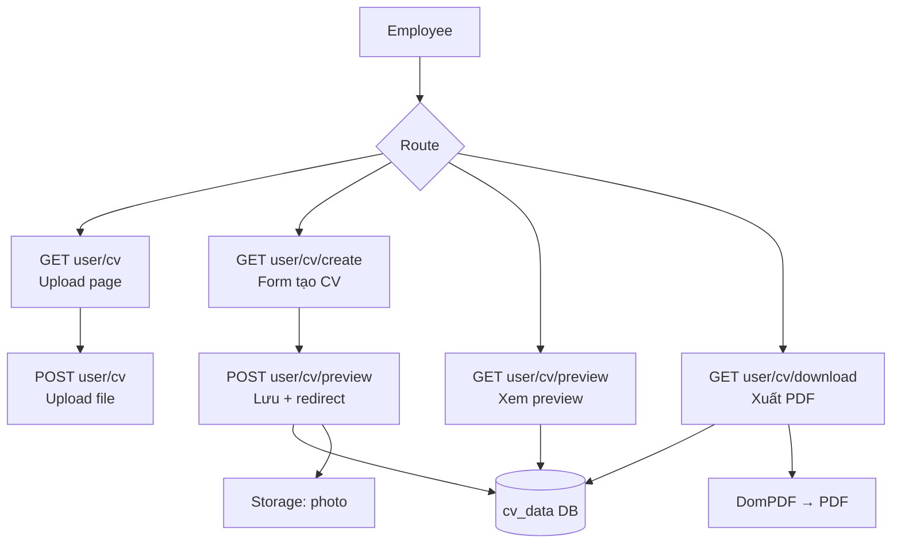

# Design Document: CV Builder

## Overview

CV Builder là module cho phép ứng viên (employee) trên website tìm việc IT thực hiện hai luồng:

1. **Upload CV file** — tải lên `.pdf`, `.doc`, `.docx` để lưu trữ và chia sẻ với nhà tuyển dụng.
2. **Tạo CV online** — điền form, chọn template Blade, xem preview HTML, xuất PDF bằng DomPDF, lưu dữ liệu vào bảng `cv_data`.

Hệ thống xây dựng trên **Laravel 11 + Blade** (PHP MVC thuần, không dùng Inertia/React). PDF được tạo bằng `barryvdh/laravel-dompdf` với hỗ trợ font Unicode cho tiếng Việt.

**Luồng dữ liệu chính:**

```
POST /user/cv/preview  →  upsert cv_data + lưu photo  →  redirect GET /user/cv/preview
GET  /user/cv/preview  →  đọc cv_data từ DB           →  render preview HTML
GET  /user/cv/download →  đọc cv_data từ DB           →  xuất PDF (rate limited 10/min)
```

---

## Architecture

Module CV Builder nằm trong `UserController` (controller hiện có), tuân theo kiến trúc MVC thuần của Laravel:

```
Request → Middleware (auth, verified, EnsureEmployee)
        → Form Request (CvFormRequest / UploadCvRequest)
        → UserController
        → CvData Model / User Model
        → Blade View / DomPDF
        → Response (HTML / PDF / Redirect)
```

### Sơ đồ luồng tổng quan



---

## Components and Interfaces

### Routes

Tất cả routes đặt trong `routes/web.php`, nhóm middleware `['auth', 'verified', 'employee']`:

```php
Route::middleware(['auth', 'verified', 'employee'])->group(function () {
    Route::get('user/cv',              [UserController::class, 'cv']);
    Route::post('user/cv',             [UserController::class, 'updateCv']);
    Route::get('user/cv/view',         [UserController::class, 'viewCv']);
    Route::get('user/cv/create',       [UserController::class, 'createCv']);
    Route::post('user/cv/preview',     [UserController::class, 'saveCv']);       // ← POST: lưu DB
    Route::get('user/cv/preview',      [UserController::class, 'showPreview'])   // ← GET: render
         ->name('cv.preview');
    Route::get('user/cv/download',     [UserController::class, 'downloadPdf'])
         ->middleware('throttle:10,1');
    Route::delete('user/cv/online',    [UserController::class, 'deleteOnlineCv']);
});
```

> **Lý do tách 2 method:** POST và GET có trách nhiệm hoàn toàn khác nhau — POST thực hiện side-effect (write DB, write Storage) còn GET chỉ đọc. Gộp chung vào một method vi phạm Single Responsibility, khó test độc lập, và dễ gây nhầm lẫn khi đọc code.

### Middleware `EnsureEmployee`

Thay vì lặp `abort(403)` trong từng method controller, tạo một middleware chuyên biệt:

```php
// app/Http/Middleware/EnsureEmployee.php
class EnsureEmployee
{
    public function handle(Request $request, Closure $next): Response
    {
        if (auth()->check() && auth()->user()->user_type === 'employer') {
            abort(403, 'Chức năng này chỉ dành cho ứng viên.');
        }
        return $next($request);
    }
}
```

Đăng ký alias trong `bootstrap/app.php`:

```php
$middleware->alias([
    'employee' => \App\Http\Middleware\EnsureEmployee::class,
    // ... các middleware khác
]);
```

> **Lý do dùng middleware thay vì `abort(403)` trong controller:** Employer check là cross-cutting concern — áp dụng cho toàn bộ route group, không phải logic nghiệp vụ của từng method. Đặt trong middleware: viết 1 lần, test 1 lần, không bao giờ bị quên khi thêm method mới. Controller chỉ còn xử lý business logic thuần.

### UserController — Các method CV

Controller **không còn** chứa `abort(403)` — việc chặn employer đã được xử lý hoàn toàn bởi middleware `EnsureEmployee` ở tầng route.

| Method | Route | Mô tả |
|---|---|---|
| `cv()` | `GET user/cv` | Hiển thị trang upload CV file + summary |
| `updateCv(UploadCvRequest)` | `POST user/cv` | Lưu file upload, cập nhật `users.resume` |
| `viewCv()` | `GET user/cv/view` | Serve file CV đã upload inline |
| `createCv()` | `GET user/cv/create` | Hiển thị form tạo CV online, pre-populate nếu có `cv_data` |
| `saveCv(CvFormRequest)` | `POST user/cv/preview` | Upsert cv_data + photo → redirect GET /preview |
| `showPreview()` | `GET user/cv/preview` | Đọc cv_data từ DB → render preview HTML |
| `downloadPdf()` | `GET user/cv/download` | Xuất PDF bằng DomPDF |
| `deleteOnlineCv()` | `DELETE user/cv/online` | Xoá `cv_data` record + photo file |

### Form Requests

**`UploadCvRequest`** — validate file upload CV:

```php
public function rules(): array
{
    return [
        'cv_file' => [
            'required',
            'file',
            'mimes:pdf,doc,docx',
            'max:5120', // 5 MB
        ],
    ];
}
```

**`CvFormRequest`** — validate form tạo CV online:

```php
public function rules(): array
{
    return [
        'full_name'          => 'required|string|max:255',
        // 'sometimes': chỉ validate nếu field có mặt trong request VÀ không rỗng
        // '{1,20}': đảm bảo nếu có giá trị thì phải có ít nhất 1 ký tự hợp lệ
        'phone'              => ['sometimes', 'nullable', 'regex:/^[\d\s\+\-\(\)]{1,20}$/'],
        'email'              => 'nullable|email|max:255',
        'address'            => 'nullable|string|max:500',
        'objective'          => 'nullable|string|max:1000',

        // --- Repeatable sections: validate từng sub-field ---
        'education'              => 'nullable|array|max:10',
        'education.*.title'      => 'nullable|string|max:150',
        'education.*.subtitle'   => 'nullable|string|max:150',
        'education.*.period'     => 'nullable|string|max:50',
        'education.*.description'=> 'nullable|string|max:500',

        'experience'              => 'nullable|array|max:10',
        'experience.*.title'      => 'nullable|string|max:150',
        'experience.*.subtitle'   => 'nullable|string|max:150',
        'experience.*.period'     => 'nullable|string|max:50',
        'experience.*.description'=> 'nullable|string|max:500',

        'projects'              => 'nullable|array|max:10',
        'projects.*.title'      => 'nullable|string|max:150',
        'projects.*.subtitle'   => 'nullable|string|max:150',
        'projects.*.period'     => 'nullable|string|max:50',
        'projects.*.description'=> 'nullable|string|max:500',

        'certifications'              => 'nullable|array|max:10',
        'certifications.*.title'      => 'nullable|string|max:150',
        'certifications.*.subtitle'   => 'nullable|string|max:150',
        'certifications.*.period'     => 'nullable|string|max:50',
        'certifications.*.description'=> 'nullable|string|max:500',

        'skills_text'        => 'nullable|string|max:1000',

        'languages'           => 'nullable|array|max:10',
        'languages.*.name'    => 'nullable|string|max:100',
        'languages.*.level'   => 'nullable|string|max:50',

        'photo'              => 'nullable|image|mimes:jpg,jpeg,png,webp|max:2048',
        'template'           => 'required|in:default,modern,minimal',
    ];
}
```

> **Lý do validate sub-fields:** Nếu chỉ validate `education` là `array` mà không validate `education.*.title`, giám khảo có thể nhập chuỗi 10.000 ký tự vào một ô — template render vỡ layout, PDF tràn trang. Giới hạn `max:150` cho title và `max:500` cho description đủ để hiển thị đẹp trên A4.

> **Lý do dùng `sometimes` + `{1,20}` thay vì `{0,20}`:** Regex `{0,20}` match chuỗi rỗng `""` nên không bao giờ fail khi phone = `""` — validation luôn pass dù user nhập ký tự không hợp lệ rồi xoá đi. Dùng `sometimes|nullable` để bỏ qua field khi không có, và `{1,20}` để đảm bảo nếu có giá trị thì phải hợp lệ.

---

## Data Models

### Migration: `create_cv_data_table`

```php
Schema::create('cv_data', function (Blueprint $table) {
    $table->id();
    $table->foreignId('user_id')->unique()->constrained()->cascadeOnDelete();
    $table->string('full_name', 255);
    $table->string('phone', 20)->nullable();
    $table->string('email', 255)->nullable();
    $table->string('address', 500)->nullable();
    $table->text('objective')->nullable();
    $table->json('education')->nullable();
    $table->json('experience')->nullable();
    $table->json('projects')->nullable();
    $table->json('certifications')->nullable();
    $table->text('skills_text')->nullable();
    $table->json('languages')->nullable();
    $table->string('photo_path')->nullable();
    $table->string('template', 50)->default('default');
    $table->timestamps();
});
```

> **Unique constraint trên `user_id`** đảm bảo mỗi employee chỉ có đúng một bản ghi CV online.

### Model: `CvData`

```php
// app/Models/CvData.php
class CvData extends Model
{
    protected $table = 'cv_data';

    protected $fillable = [
        'user_id', 'full_name', 'phone', 'email', 'address',
        'objective', 'education', 'experience', 'projects',
        'certifications', 'skills_text', 'languages',
        'photo_path', 'template',
    ];

    protected $casts = [
        'education'      => 'array',
        'experience'     => 'array',
        'projects'       => 'array',
        'certifications' => 'array',
        'languages'      => 'array',
    ];

    public function user(): BelongsTo
    {
        return $this->belongsTo(User::class);
    }
}
```

### Model: `User` (bổ sung quan hệ)

```php
// Thêm vào app/Models/User.php
public function cvData(): HasOne
{
    return $this->hasOne(CvData::class);
}
```

### Cấu trúc JSON columns

**`education` / `experience` / `projects` / `certifications`** — mảng các object:

```json
[
  {
    "title": "Đại học Bách Khoa",
    "subtitle": "Kỹ thuật phần mềm",
    "period": "2018 - 2022",
    "description": "Tốt nghiệp loại Giỏi"
  }
]
```

**`languages`** — mảng các object:

```json
[
  { "name": "Tiếng Anh", "level": "B2" }
]
```

---

## Views

### Cấu trúc file view

```
resources/views/
├── user/
│   ├── cv.blade.php              ← Trang upload CV + summary
│   ├── create-cv.blade.php       ← Form tạo CV online
│   └── cv-preview.blade.php      ← Preview CV + action buttons
└── cv-templates/
    ├── default.blade.php         ← Template mặc định
    ├── modern.blade.php          ← Template hiện đại
    └── minimal.blade.php         ← Template tối giản
```

### `user/cv.blade.php`

- Form upload file (input `cv_file`, accept `.pdf,.doc,.docx`)
- Hiển thị tên file hiện tại nếu `$user->resume` không null
- Summary section: link đến preview nếu có `cv_data`, link đến view nếu có `resume`

### `user/create-cv.blade.php`

- Form với tất cả các trường theo Requirement 2.1
- Các section repeatable (education, experience, projects, certifications, languages) dùng JavaScript để thêm/xoá dòng
- Select `template` với 3 options: `default`, `modern`, `minimal`
- Pre-populate từ `$cvData` nếu tồn tại

### `user/cv-preview.blade.php`

- Nhúng template CV đã chọn: `@include('cv-templates.' . $cvData->template)`
- Hiển thị label tên template đang dùng
- Action buttons: "Chỉnh sửa" → `GET user/cv/create`, "Tải PDF" → `GET user/cv/download`, "Xoá CV" → `DELETE user/cv/online` (form với `@method('DELETE')`)

### `cv-templates/*.blade.php`

Mỗi template nhận biến `$cvData` (object CvData) và `$photoBase64` (string|null):

```blade
{{-- Khai báo bắt buộc cho PDF --}}
<meta charset="UTF-8">
<style>
    body { font-family: 'DejaVu Sans', sans-serif; }
</style>
```

---

## Logic Xử Lý Chính

### Upload CV file (`updateCv`)

```
1. Validate qua UploadCvRequest
2. Nếu $user->resume tồn tại → Storage::disk('public')->delete($user->resume)
3. Tạo filename: Str::uuid() . '_' . $file->getClientOriginalName()
4. Lưu file: $path = $file->storeAs('resume', $filename, 'public')
5. $user->update(['resume' => $path])
6. Redirect GET user/cv với success flash
```

### Lưu CV online (`saveCv` — POST)

```
1. Validate qua CvFormRequest  [employer đã bị chặn bởi middleware EnsureEmployee]
2. Xử lý photo:
   a. Nếu có file photo mới:
      - Lưu photo mới trước: $newPhotoPath = $request->file('photo')->store('images/cv', 'public')
      - Nếu lưu thành công: xoá photo cũ nếu tồn tại
   b. Nếu không có photo mới: giữ nguyên photo_path cũ ($newPhotoPath = $existingPhotoPath)
3. Upsert cv_data:
   try {
       CvData::updateOrCreate(
           ['user_id' => auth()->id()],
           [...$validated, 'photo_path' => $newPhotoPath]
       )
   } catch (Exception $e) {
       // DB upsert thất bại → xoá photo mới vừa upload (tránh orphan)
       if ($newPhotoPath !== $existingPhotoPath) {
           Storage::disk('public')->delete($newPhotoPath);
       }
       log($e); return back()->withInput()->with('error', ...)
   }
4. Redirect GET user/cv/preview với success flash
```

> **Orphan photo cleanup:** Nếu DB upsert thất bại sau khi đã lưu photo mới, photo mới phải bị xoá ngay để tránh file rác tích tụ trong Storage. Photo cũ không bị xoá cho đến khi upsert thành công.

### Render preview (`showPreview` — GET)

```
1. [employer đã bị chặn bởi middleware EnsureEmployee]
2. $cvData = auth()->user()->cvData
3. Nếu null → redirect GET user/cv/create với info flash
4. Kiểm tra template file tồn tại:
   View::exists('cv-templates.' . $cvData->template)
   → Nếu không tồn tại: $template = 'default', warning flash
5. return view('user.cv-preview', compact('cvData', 'template'))
```

### Xuất PDF (`downloadPdf`)

```
1. $cvData = auth()->user()->cvData
2. Nếu null → redirect GET user/cv/create với info flash
3. Xử lý photo:
   - Nếu $cvData->photo_path tồn tại và file tồn tại:
     $photoBase64 = 'data:image/' . $ext . ';base64,' . base64_encode(
         Storage::disk('public')->get($cvData->photo_path)
     )
   - Nếu không: $photoBase64 = null
4. Kiểm tra template, fallback về 'default' nếu cần
5. $pdf = Pdf::loadView('cv-templates.' . $template, compact('cvData', 'photoBase64'))
         ->setPaper('A4', 'portrait')
6. return $pdf->download('cv-' . auth()->id() . '.pdf')
```

### Xoá CV online (`deleteOnlineCv`)

```
1. $cvData = auth()->user()->cvData
2. Nếu null → redirect GET user/cv/create
3. Xoá photo file nếu có (log lỗi nếu thất bại, không dừng)
4. $cvData->delete()
5. Redirect GET user/cv/create với success flash
```

---

## DomPDF Configuration

### `config/dompdf.php`

DomPDF v2.x không còn dùng key `defines` — cấu hình được đặt trực tiếp trong mảng `options`:

```php
return [
    'show_warnings'   => false,
    'options'         => [
        'font_subsetting'    => true,          // ← v2.x key (thay cho DOMPDF_ENABLE_FONT_SUBSETTING)
        'default_font'       => 'DejaVu Sans', // ← v2.x key (thay cho DOMPDF_DEFAULT_FONT)
        'default_paper_size' => 'A4',          // ← v2.x key
        'default_paper_orientation' => 'portrait',
        'isHtml5ParserEnabled' => true,
        'isRemoteEnabled'    => false,         // tắt remote URL để bảo mật
    ],
];
```

> **Lưu ý:** Key `defines` (dạng `DOMPDF_*`) là cú pháp của DomPDF v1.x. Từ v2.0 trở đi (package `barryvdh/laravel-dompdf ^2.0`), tất cả config nằm trong key `options`. Dùng sai key sẽ bị silently ignored — font subsetting không được bật dù config trông đúng.

### Font tiếng Việt

- Sử dụng font **DejaVu Sans** (bundled với DomPDF, hỗ trợ Unicode cơ bản bao gồm tiếng Việt)
- Nếu cần hỗ trợ đầy đủ hơn: thêm font **Noto Sans** vào `storage/fonts/` và đăng ký trong `dompdf.php`
- Tất cả template Blade khai báo `<meta charset="UTF-8">` và `font-family: 'DejaVu Sans', sans-serif`

---

## Correctness Properties

*A property is a characteristic or behavior that should hold true across all valid executions of a system — essentially, a formal statement about what the system should do. Properties serve as the bridge between human-readable specifications and machine-verifiable correctness guarantees.*

### Property 1: UUID filename uniqueness

*For any* two valid CV file uploads by the same or different employees, the generated filenames stored in `users.resume` SHALL be distinct.

**Validates: Requirements 1.2**

---

### Property 2: Invalid file extension rejection

*For any* file whose extension is not in `{pdf, doc, docx}`, submitting it to `POST user/cv` SHALL result in a validation error response (HTTP 422) and the `users.resume` column SHALL remain unchanged.

**Validates: Requirements 1.3**

---

### Property 3: File size limit enforcement

*For any* file whose size exceeds 5 MB, submitting it to `POST user/cv` SHALL result in a validation error response and the file SHALL NOT be stored in Storage_Public.

**Validates: Requirements 1.4**

---

### Property 4: Old file cleanup on re-upload

*For any* employee who has an existing `users.resume` path, uploading a new CV file SHALL result in the old file being deleted from Storage_Public and only the new file remaining.

**Validates: Requirements 1.7**

---

### Property 5: Form pre-population round-trip

*For any* `cv_data` record belonging to an employee, visiting `GET user/cv/create` SHALL render a form where every stored field value appears as the pre-populated value of its corresponding input.

**Validates: Requirements 2.2, 7.2**

---

### Property 6: Validation rejects invalid full_name

*For any* form submission where `full_name` is empty or exceeds 255 characters, `CvFormRequest` SHALL return a validation error for `full_name` and no `cv_data` record SHALL be created or modified.

**Validates: Requirements 2.3**

---

### Property 7: Validation rejects invalid inputs (phone, email, photo, template, sub-fields)

*For any* form submission where `phone` contains invalid characters or exceeds 20 characters, OR `email` is present but malformed, OR `photo` has an invalid extension or exceeds 2 MB, OR `template` is not one of `{default, modern, minimal}`, `CvFormRequest` SHALL return a validation error for the offending field and no `cv_data` record SHALL be created or modified.

**Validates: Requirements 2.4, 2.5, 2.6, 2.7, 2.8**

---

### Property 18: Sub-field length limits prevent layout overflow

*For any* form submission where any `education.*.title`, `experience.*.title`, `projects.*.title`, or `certifications.*.title` exceeds 150 characters, OR any `*.description` field exceeds 500 characters, `CvFormRequest` SHALL return a validation error for the offending sub-field and no `cv_data` record SHALL be created or modified.

**Validates: Requirements 2.1** (implicit — form fields must be bounded to prevent template rendering failures)

---

### Property 8: CV data persistence round-trip

*For any* valid form submission to `POST user/cv/preview`, all submitted field values (full_name, phone, email, address, objective, skills_text, template) SHALL be retrievable from the `cv_data` record after the upsert completes.

**Validates: Requirements 4.1, 3.2**

---

### Property 9: JSON columns serialization round-trip

*For any* array of education, experience, projects, certifications, or languages items submitted in the form, storing them to `cv_data` and then reading them back via the `CvData` model SHALL produce arrays equivalent to the original input.

**Validates: Requirements 4.2**

---

### Property 10: One cv_data record per employee (upsert invariant)

*For any* employee who submits the CV form N times (N ≥ 1), the `cv_data` table SHALL contain exactly one record for that employee's `user_id` after all submissions.

**Validates: Requirements 4.5**

---

### Property 11: Photo cleanup on update

*For any* employee who has an existing `cv_data.photo_path`, submitting the CV form with a new photo SHALL result in the old photo file being deleted from Storage_Public and only the new photo file remaining.

**Validates: Requirements 4.3**

---

### Property 12: PDF filename convention

*For any* employee with a `cv_data` record, `GET user/cv/download` SHALL return a PDF file whose `Content-Disposition` filename is exactly `cv-{user_id}.pdf`.

**Validates: Requirements 5.1**

---

### Property 13: Photo stored independently of base64 encoding

*For any* employee with a `cv_data` record where `photo_path` is set, the photo file SHALL exist as a physical file in Storage_Public at `cv_data.photo_path`, and reading that file via `Storage::disk('public')->get($path)` SHALL return non-empty bytes that can be successfully encoded to a base64 string.

> **Thay thế Property 13 cũ (stdlib round-trip):** Test `base64_encode(base64_decode($x)) === $x` chỉ kiểm tra stdlib PHP, không kiểm tra logic ứng dụng. Property mới kiểm tra rằng file thực sự tồn tại trong Storage và có thể đọc được — đây là điều kiện cần để PDF embedding hoạt động đúng.

**Validates: Requirements 5.3**

---

### Property 14: Rate limiting enforcement

*For any* employee who sends more than 10 requests to `GET user/cv/download` within a 60-second window, the 11th and subsequent requests within that window SHALL receive an HTTP 429 response.

**Validates: Requirements 5.7**

---

### Property 15: CV deletion removes record and photo

*For any* employee with a `cv_data` record, submitting `DELETE user/cv/online` SHALL result in no `cv_data` record existing for that employee's `user_id` in the database after the operation completes.

**Validates: Requirements 6.2**

---

### Property 16: Auth middleware protects all CV routes

*For any* unauthenticated HTTP request to any route matching `user/cv/*`, the response SHALL be a redirect to the login page (HTTP 302 to `/login`).

**Validates: Requirements 8.1**

---

### Property 17: Employer access returns 403

*For any* authenticated user with `user_type = 'employer'`, any HTTP request to any route matching `user/cv/*` SHALL return an HTTP 403 response.

**Validates: Requirements 8.3**

---

## Error Handling

| Tình huống | Hành động |
|---|---|
| File upload thất bại (storage) | Catch exception, log, redirect về form với error flash |
| Photo upload thất bại | Catch exception, log, return form với error flash + `withInput()` |
| DB upsert thất bại | Catch exception, log, return form với error flash + `withInput()` |
| DomPDF thất bại | Catch exception, log, redirect về `GET user/cv/preview` với error flash |
| Template không tồn tại | Fallback về `default`, warning flash (không throw exception) |
| Photo file không tồn tại khi xuất PDF | Pass `null` cho template, tiếp tục xuất PDF |
| Photo file xoá thất bại khi delete CV | Log lỗi, vẫn xoá DB record, redirect bình thường |
| `users.resume` null khi view file | Redirect `GET user/cv` với info flash |
| `users.resume` không null nhưng file mất | Redirect `GET user/cv` với error flash |
| Rate limit vượt quá | HTTP 429 với thông báo retry-after |

---

## Testing Strategy

### Đánh giá PBT

Feature CV Builder bao gồm các pure function và business logic (validation, file naming, JSON serialization, upsert logic) phù hợp với property-based testing. Tuy nhiên, phần lớn logic liên quan đến HTTP requests, file I/O, và database — những thành phần này phù hợp hơn với example-based unit tests và feature tests của Laravel.

**PBT áp dụng cho:**
- Validation logic trong Form Requests (input space lớn, nhiều edge case)
- JSON serialization round-trip của các JSON columns
- Upsert uniqueness invariant

**Không dùng PBT cho:**
- File I/O operations (chi phí cao, không phải pure function)
- HTTP routing và middleware (dùng Laravel feature tests)
- DomPDF rendering (external library)

### Unit Tests (PHPUnit)

- `CvFormRequestTest` — test tất cả validation rules với valid/invalid inputs
- `UploadCvRequestTest` — test file extension và size validation
- `CvDataModelTest` — test JSON casts, `updateOrCreate` uniqueness

### Feature Tests (Laravel HTTP Tests)

- `CvUploadTest` — test toàn bộ luồng upload file (success, invalid extension, size exceeded, old file cleanup)
- `CvOnlineCreateTest` — test form display, pre-population, validation errors
- `CvPreviewTest` — test POST save + redirect, GET render, missing record redirect, template fallback
- `CvDownloadTest` — test PDF generation, rate limiting (429), missing record redirect
- `CvDeleteTest` — test các case sau:
  - Xoá record thành công → `cv_data` bị xoá, redirect với success flash
  - Xoá khi photo file không tồn tại trong Storage → vẫn xoá DB record, không throw exception (**Validates: Requirements 6.3**)
  - DELETE form phải có `@csrf` token — request không có CSRF token SHALL nhận HTTP 419
- `CvAuthTest` — test auth middleware (unauthenticated → 302), verified middleware, employer → 403 qua `EnsureEmployee` middleware (không test từng controller method riêng lẻ)

### Property-Based Tests (PHPUnit + manual generators)

Sử dụng PHPUnit với data providers để simulate property-based testing:

- **Property 6 & 7**: Data provider với nhiều invalid inputs cho `full_name`, `phone`, `email`, `photo`, `template`
- **Property 9**: Data provider với nhiều cấu trúc array khác nhau cho JSON columns
- **Property 10**: Test upsert N lần với cùng `user_id`, verify count = 1
- **Property 18**: Data provider với `education.*.title` > 150 chars, `*.description` > 500 chars → verify validation error trả về đúng field path (e.g., `education.0.title`)

### Cấu hình test

```xml
<!-- phpunit.xml — đã có sẵn trong project -->
<testsuites>
    <testsuite name="Feature">
        <directory>tests/Feature</directory>
    </testsuite>
    <testsuite name="Unit">
        <directory>tests/Unit</directory>
    </testsuite>
</testsuites>
```

Chạy tests:

```bash
php artisan test
# hoặc
./vendor/bin/phpunit
```
