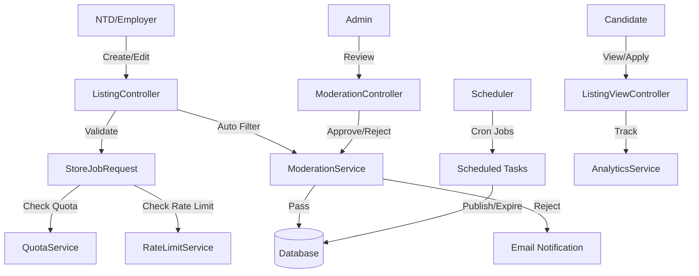
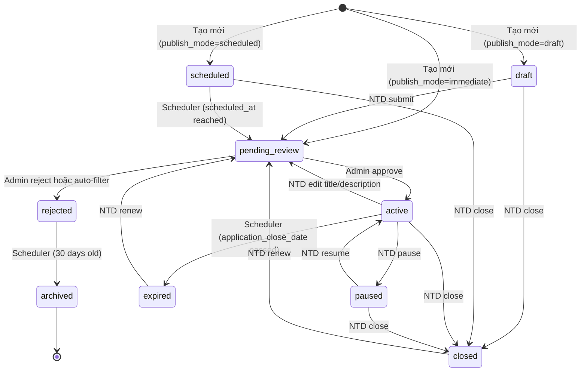

# Design Document: Job Posting & Moderation

## Overview

Module Job Posting & Moderation nâng cấp hệ thống đăng tin tuyển dụng của ITWorks từ form đơn giản thành hệ thống quản lý toàn diện với các tính năng:

- **Quản lý vòng đời tin tuyển dụng**: State machine với 9 trạng thái từ draft → active → expired
- **Kiểm duyệt tự động & thủ công**: Lọc từ khóa tự động + Admin review thủ công
- **Phân quyền và Quota**: Giới hạn tin đăng theo subscription plan (5 monthly, 15 yearly)
- **Rate limiting**: Chống spam (5 tin/ngày cho paid, 2 tin/ngày cho trial)
- **Analytics**: Tracking lượt xem, tương tác, conversion rate
- **Scheduler automation**: Tự động publish, expire, archive listings
- **Notification system**: Email notifications cho các sự kiện quan trọng

### Kiến trúc tổng quan




## Architecture

### Layer Architecture

Hệ thống tuân theo kiến trúc MVC Laravel chuẩn với các layer bổ sung:

```
├── Presentation Layer (Controllers, Views)
│   ├── ListingController: CRUD operations cho NTD
│   ├── ModerationController: Admin moderation interface
│   ├── AnalyticsController: Thống kê và báo cáo
│   └── API Controllers: RESTful endpoints
│
├── Business Logic Layer (Services)
│   ├── ModerationService: Keyword filtering, status transitions
│   ├── QuotaService: Subscription-based limits
│   ├── RateLimitService: Spam prevention
│   ├── AnalyticsService: View tracking, aggregation
│   └── NotificationService: Email dispatch
│
├── Data Access Layer (Models, Repositories)
│   ├── Listing Model: Core listing entity
│   ├── ListingRepository: Query optimization
│   └── Related Models: Skill, Category, Report, View, AuditLog
│
└── Infrastructure Layer
    ├── Scheduler: Laravel Task Scheduler
    ├── Queue: Background job processing
    ├── Cache: Redis/File cache cho rate limiting
    └── Storage: File upload handling
```


### State Machine Architecture

Listing vận hành theo state machine với 9 trạng thái:




## Components and Interfaces

### 1. Database Schema Design

#### 1.1. Bảng `listings` (Core Table)

Migration file: `database/migrations/2024_01_XX_create_listings_table.php`

```php
Schema::create('listings', function (Blueprint $table) {
    $table->id();
    $table->foreignId('user_id')->constrained('users')->onDelete('cascade');
    $table->foreignId('category_id')->constrained('categories');
    
    // Core fields
    $table->string('title', 255);
    $table->text('description');
    $table->string('address');
    $table->enum('job_type', ['full_time', 'part_time', 'contract', 'internship', 'freelance']);
    $table->enum('level', ['intern', 'junior', 'middle', 'senior', 'manager', 'director'])->nullable();
    
    // Salary fields
    $table->decimal('salary_min', 12, 2)->nullable();
    $table->decimal('salary_max', 12, 2)->nullable();
    $table->boolean('is_negotiable')->default(false);
    $table->boolean('hide_salary')->default(false);
    
    // Application fields
    $table->date('application_close_date');
    $table->date('start_date')->nullable();
    $table->integer('vacancy_count')->default(1);
    
    // Contact fields
    $table->string('contact_email')->nullable();
    $table->string('contact_phone', 20)->nullable();
    
    // File upload
    $table->string('jd_file_path')->nullable();
    
    // Publishing mode & state
    $table->enum('publish_mode', ['immediate', 'scheduled', 'draft'])->default('draft');
    $table->timestamp('scheduled_at')->nullable();
    $table->enum('status', [
        'draft', 'pending_review', 'scheduled', 'active', 
        'paused', 'closed', 'rejected', 'expired', 'archived'
    ])->default('draft');
    
    // Moderation fields
    $table->text('rejection_reason')->nullable();
    $table->timestamp('rejected_at')->nullable();
    $table->string('archived_reason')->nullable(); // 'auto_expired', 'user_deleted', 'manual'
    
    $table->timestamps();
    $table->softDeletes();
    
    // Indexes
    $table->index(['user_id', 'status']);
    $table->index(['status', 'application_close_date']);
    $table->index(['scheduled_at']);
    $table->fullText(['title', 'description'], 'listing_search_fulltext');
});
```


#### 1.2. Bảng `listing_skill` (Pivot Table)

Migration file: `database/migrations/2024_01_XX_create_listing_skill_table.php`

```php
Schema::create('listing_skill', function (Blueprint $table) {
    $table->id();
    $table->foreignId('listing_id')->constrained('listings')->onDelete('cascade');
    $table->foreignId('skill_id')->constrained('skills')->onDelete('cascade');
    $table->timestamps();
    
    $table->unique(['listing_id', 'skill_id']);
    $table->index('skill_id');
});
```

#### 1.3. Bảng `skills` (Existing table - cần update)

Migration file: `database/migrations/2024_01_XX_update_skills_table.php`

```php
Schema::table('skills', function (Blueprint $table) {
    if (!Schema::hasColumn('skills', 'slug')) {
        $table->string('slug')->unique()->after('name');
    }
    if (!Schema::hasColumn('skills', 'usage_count')) {
        $table->integer('usage_count')->default(0); // Đếm số listing sử dụng skill
    }
});

// Index cho autocomplete search
Schema::table('skills', function (Blueprint $table) {
    $table->index('name');
});
```


#### 1.4. Bảng `listing_views` (Analytics)

Migration file: `database/migrations/2024_01_XX_create_listing_views_table.php`

```php
Schema::create('listing_views', function (Blueprint $table) {
    $table->id();
    $table->foreignId('listing_id')->constrained('listings')->onDelete('cascade');
    $table->foreignId('user_id')->nullable()->constrained('users')->onDelete('set null');
    $table->ipAddress('ip_address');
    $table->string('traffic_source')->nullable(); // Referrer URL
    $table->enum('action_type', ['view', 'apply_click']);
    $table->timestamp('created_at');
    
    // Indexes cho analytics queries
    $table->index(['listing_id', 'created_at']);
    $table->index(['listing_id', 'action_type', 'created_at']);
    $table->index(['user_id', 'created_at']);
});
```

#### 1.5. Bảng `listing_reports` (Báo cáo vi phạm)

Migration file: `database/migrations/2024_01_XX_create_listing_reports_table.php`

```php
Schema::create('listing_reports', function (Blueprint $table) {
    $table->id();
    $table->foreignId('listing_id')->constrained('listings')->onDelete('cascade');
    $table->foreignId('user_id')->constrained('users')->onDelete('cascade'); // Candidate
    $table->enum('reason', ['fake_job', 'scam', 'inappropriate', 'misleading']);
    $table->text('description')->nullable();
    $table->enum('status', ['pending', 'reviewed', 'dismissed'])->default('pending');
    $table->foreignId('reviewed_by')->nullable()->constrained('users')->onDelete('set null'); // Admin
    $table->timestamp('reviewed_at')->nullable();
    $table->timestamps();
    
    // Unique constraint: 1 user chỉ report 1 listing 1 lần
    $table->unique(['listing_id', 'user_id']);
    $table->index(['listing_id', 'status']);
});
```


#### 1.6. Bảng `listing_audit_logs` (Lịch sử thay đổi)

Migration file: `database/migrations/2024_01_XX_create_listing_audit_logs_table.php`

```php
Schema::create('listing_audit_logs', function (Blueprint $table) {
    $table->id();
    $table->foreignId('listing_id')->constrained('listings')->onDelete('cascade');
    $table->foreignId('user_id')->constrained('users')->onDelete('cascade'); // Người thực hiện
    $table->string('action'); // 'created', 'updated', 'status_changed', 'hard_deleted', 'auto_paused_user_deleted', 'auto_archived_user_deleted'
    $table->json('old_values')->nullable(); // Giá trị cũ
    $table->json('new_values')->nullable(); // Giá trị mới
    $table->text('note')->nullable(); // Ghi chú thêm
    $table->timestamp('created_at');
    
    $table->index(['listing_id', 'created_at']);
    $table->index(['user_id', 'created_at']);
});
```

#### 1.7. Bảng `banned_keywords` (Từ khóa cấm)

Migration file: `database/migrations/2024_01_XX_create_banned_keywords_table.php`

```php
Schema::create('banned_keywords', function (Blueprint $table) {
    $table->id();
    $table->string('keyword');
    $table->boolean('is_active')->default(true);
    $table->string('severity', 20)->default('high'); // 'high', 'medium', 'low'
    $table->timestamps();
    
    $table->index(['keyword', 'is_active']);
});
```


#### 1.8. Update Bảng `users` (Thêm trường liên quan)

Migration file: `database/migrations/2024_01_XX_update_users_table_for_listings.php`

```php
Schema::table('users', function (Blueprint $table) {
    if (!Schema::hasColumn('users', 'email_notify')) {
        $table->boolean('email_notify')->default(true);
    }
    if (!Schema::hasColumn('users', 'is_banned')) {
        $table->boolean('is_banned')->default(false);
    }
    if (!Schema::hasColumn('users', 'banned_at')) {
        $table->timestamp('banned_at')->nullable();
    }
});
```

#### 1.9. Update Bảng `categories` (Existing table)

Migration file: `database/migrations/2024_01_XX_update_categories_table.php`

```php
Schema::table('categories', function (Blueprint $table) {
    if (!Schema::hasColumn('categories', 'slug')) {
        $table->string('slug')->unique()->after('name');
    }
    if (!Schema::hasColumn('categories', 'is_active')) {
        $table->boolean('is_active')->default(true);
    }
});

// Index cho dropdown và tìm kiếm
Schema::table('categories', function (Blueprint $table) {
    $table->index(['is_active', 'name']);
});
```


### 2. API Endpoints Design

#### 2.1. Listing CRUD Endpoints (NTD)

**Base URL**: `/api/employer/listings`

| Method | Endpoint | Controller | Action | Middleware | Description |
|--------|----------|------------|---------|------------|-------------|
| GET | `/` | ListingController | index | auth, employer | Danh sách listing của NTD |
| GET | `/{id}` | ListingController | show | auth, employer | Chi tiết 1 listing |
| POST | `/` | ListingController | store | auth, employer, quota, ratelimit | Tạo listing mới |
| PUT | `/{id}` | ListingController | update | auth, employer, owner | Cập nhật listing |
| DELETE | `/{id}` | ListingController | destroy | auth, employer, owner | Soft delete (chuyển closed) |
| POST | `/{id}/pause` | ListingController | pause | auth, employer, owner | Tạm dừng listing |
| POST | `/{id}/resume` | ListingController | resume | auth, employer, owner | Tiếp tục listing |
| POST | `/{id}/close` | ListingController | close | auth, employer, owner | Đóng listing |
| POST | `/{id}/renew` | ListingController | renew | auth, employer, owner, quota | Gia hạn listing |
| POST | `/{id}/clone` | ListingController | clone | auth, employer, quota, ratelimit | Nhân bản listing |

**Request Body Example (POST /api/employer/listings)**:

```json
{
  "title": "Senior PHP Developer",
  "description": "<p>Mô tả công việc chi tiết...</p>",
  "category_id": 1,
  "job_type": "full_time",
  "level": "senior",
  "address": "Hà Nội",
  "salary_min": 20000000,
  "salary_max": 30000000,
  "is_negotiable": false,
  "hide_salary": false,
  "application_close_date": "2024-12-31",
  "start_date": "2024-02-01",
  "vacancy_count": 2,
  "contact_email": "hr@company.com",
  "contact_phone": "0987654321",
  "publish_mode": "immediate",
  "scheduled_at": null,
  "skills": [1, 5, 8, 12],
  "jd_file": "base64_encoded_file_data"
}
```


#### 2.2. Admin Moderation Endpoints

**Base URL**: `/api/admin/listings`

| Method | Endpoint | Controller | Action | Middleware | Description |
|--------|----------|------------|---------|------------|-------------|
| GET | `/pending` | ModerationController | pending | auth, admin | Listing chờ duyệt |
| POST | `/{id}/approve` | ModerationController | approve | auth, admin | Duyệt listing |
| POST | `/{id}/reject` | ModerationController | reject | auth, admin | Từ chối listing |
| GET | `/{id}/audit-logs` | ModerationController | auditLogs | auth, admin | Lịch sử thay đổi |
| DELETE | `/{id}/hard-delete` | ModerationController | hardDelete | auth, admin | Xóa vĩnh viễn |
| GET | `/reports` | ReportController | index | auth, admin | Danh sách báo cáo |
| POST | `/reports/{id}/review` | ReportController | review | auth, admin | Xử lý báo cáo |

**Request Body Example (POST /api/admin/listings/{id}/reject)**:

```json
{
  "rejection_reason": "Nội dung không phù hợp với chính sách. Vui lòng loại bỏ từ khóa 'xxx' và đăng lại."
}
```

#### 2.3. Analytics Endpoints

**Base URL**: `/api/listings`

| Method | Endpoint | Controller | Action | Middleware | Description |
|--------|----------|------------|---------|------------|-------------|
| GET | `/{id}/analytics` | AnalyticsController | show | auth, owner-or-admin | Analytics của 1 listing |
| GET | `/analytics/overview` | AnalyticsController | overview | auth, admin | Thống kê toàn hệ thống |

**Response Example (GET /api/listings/{id}/analytics)**:

```json
{
  "listing_id": 123,
  "total_views": 1250,
  "total_apply_clicks": 85,
  "conversion_rate": 6.8,
  "views_by_day": [
    {"date": "2024-01-20", "views": 45, "apply_clicks": 3},
    {"date": "2024-01-21", "views": 52, "apply_clicks": 4},
    {"date": "2024-01-22", "views": 48, "apply_clicks": 2}
  ],
  "top_traffic_sources": [
    {"source": "google.com", "count": 320},
    {"source": "direct", "count": 280}
  ]
}
```


#### 2.4. Public Endpoints (Candidate)

**Base URL**: `/api/listings`

| Method | Endpoint | Controller | Action | Middleware | Description |
|--------|----------|------------|---------|------------|-------------|
| GET | `/` | PublicListingController | index | - | Tìm kiếm listing (public) |
| GET | `/{id}` | PublicListingController | show | - | Chi tiết listing + track view |
| POST | `/{id}/report` | ReportController | store | auth, candidate | Báo cáo listing |

**Query Parameters for GET /api/listings**:

```
?keyword=php developer
&category_id=1
&job_type=full_time,contract
&address=Hà Nội
&salary_min=15000000
&salary_max=25000000
&skills=1,5,8
&page=1
&per_page=20
&sort=created_at,desc
```

#### 2.5. Middleware Implementation

**File**: `app/Http/Middleware/CheckQuota.php`

```php
class CheckQuota
{
    public function handle($request, Closure $next)
    {
        $user = $request->user();
        
        if ($user->is_admin) {
            return $next($request);
        }
        
        $quotaService = app(QuotaService::class);
        
        if (!$quotaService->canCreateListing($user)) {
            return response()->json([
                'message' => 'Bạn đã đạt giới hạn tin đăng. Vui lòng nâng cấp gói hoặc đóng bớt tin cũ.',
                'current_active': $quotaService->getActiveListingCount($user),
                'max_allowed': $quotaService->getQuotaLimit($user)
            ], 403);
        }
        
        return $next($request);
    }
}
```


**File**: `app/Http/Middleware/CheckRateLimit.php`

```php
class CheckRateLimit
{
    public function handle($request, Closure $next)
    {
        $user = $request->user();
        
        if ($user->is_admin) {
            return $next($request);
        }
        
        $rateLimitService = app(RateLimitService::class);
        
        if (!$rateLimitService->canCreateListing($user)) {
            $remaining = $rateLimitService->getRemainingAttempts($user);
            $resetAt = $rateLimitService->getResetTime($user);
            
            return response()->json([
                'message' => 'Bạn đã vượt quá giới hạn tạo tin trong 24 giờ.',
                'remaining': $remaining,
                'reset_at' => $resetAt
            ], 429);
        }
        
        return $next($request);
    }
}
```

### 3. State Machine Implementation

#### 3.1. State Transition Rules

**File**: `app/Services/ListingStateMachine.php`

```php
class ListingStateMachine
{
    private const TRANSITIONS = [
        'draft' => ['pending_review', 'closed'],
        'pending_review' => ['active', 'rejected'],
        'scheduled' => ['pending_review', 'closed'],
        'active' => ['paused', 'closed', 'expired', 'pending_review'],
        'paused' => ['active', 'closed'],
        'expired' => ['pending_review'],
        'closed' => ['pending_review'],
        'rejected' => ['archived'],
        'archived' => []
    ];
    
    public function canTransition(Listing $listing, string $toStatus): bool
    {
        $allowedTransitions = self::TRANSITIONS[$listing->status] ?? [];
        return in_array($toStatus, $allowedTransitions);
    }
    
    public function transition(Listing $listing, string $toStatus, ?string $reason = null): bool
    {
        if (!$this->canTransition($listing, $toStatus)) {
            throw new InvalidStateTransitionException(
                "Cannot transition from {$listing->status} to {$toStatus}"
            );
        }
        
        $oldStatus = $listing->status;
        $listing->status = $toStatus;
        
        // Set rejection fields
        if ($toStatus === 'rejected') {
            $listing->rejection_reason = $reason;
            $listing->rejected_at = now();
        }
        
        $listing->save();
        
        // Log audit
        ListingAuditLog::create([
            'listing_id' => $listing->id,
            'user_id' => auth()->id() ?? 0,
            'action' => 'status_changed',
            'old_values' => ['status' => $oldStatus],
            'new_values' => ['status' => $toStatus],
            'note' => $reason
        ]);
        
        // Trigger events
        event(new ListingStatusChanged($listing, $oldStatus, $toStatus));
        
        return true;
    }
}
```


#### 3.2. Event Hooks

**File**: `app/Events/ListingStatusChanged.php`

```php
class ListingStatusChanged implements ShouldBroadcast
{
    public function __construct(
        public Listing $listing,
        public string $oldStatus,
        public string $newStatus
    ) {}
    
    public function broadcastOn()
    {
        return new PrivateChannel('user.' . $this->listing->user_id);
    }
}
```

**File**: `app/Listeners/SendListingStatusNotification.php`

```php
class SendListingStatusNotification
{
    public function handle(ListingStatusChanged $event)
    {
        $listing = $event->listing;
        $user = $listing->user;
        
        // Kiểm tra email_notify
        if (!$user->email_notify) {
            return;
        }
        
        // Gửi email theo status
        match($event->newStatus) {
            'active' => Mail::to($user)->queue(new ListingApprovedMail($listing)),
            'rejected' => Mail::to($user)->queue(new ListingRejectedMail($listing)),
            'expired' => Mail::to($user)->queue(new ListingExpiredMail($listing)),
            default => null
        };
    }
}
```


### 4. Services Architecture

#### 4.1. ModerationService

**File**: `app/Services/ModerationService.php`

```php
class ModerationService
{
    private StateMachine $stateMachine;
    private NotificationService $notificationService;
    
    public function autoModerate(Listing $listing): void
    {
        // Load banned keywords from DB and config
        $bannedKeywords = $this->getBannedKeywords();
        
        // Scan title and description
        $content = strtolower($listing->title . ' ' . strip_tags($listing->description));
        $violations = [];
        
        foreach ($bannedKeywords as $keyword) {
            if (str_contains($content, strtolower($keyword->keyword))) {
                $violations[] = $keyword->keyword;
            }
        }
        
        // Auto-reject if violations found
        if (!empty($violations)) {
            $reason = 'Phát hiện từ khóa vi phạm: ' . implode(', ', $violations);
            $this->stateMachine->transition($listing, 'rejected', $reason);
            return;
        }
        
        // Keep in pending_review for manual review
        $listing->status = 'pending_review';
        $listing->save();
    }
    
    public function approve(Listing $listing): void
    {
        $this->stateMachine->transition($listing, 'active');
        
        try {
            $this->notificationService->sendApprovalEmail($listing);
        } catch (\Exception $e) {
            // Email failure should not rollback status change
            Log::error('Failed to send approval email', [
                'listing_id' => $listing->id,
                'error' => $e->getMessage()
            ]);
        }
    }
    
    public function reject(Listing $listing, string $reason): void
    {
        $this->stateMachine->transition($listing, 'rejected', $reason);
        
        try {
            $this->notificationService->sendRejectionEmail($listing, $reason);
        } catch (\Exception $e) {
            Log::error('Failed to send rejection email', [
                'listing_id' => $listing->id,
                'error' => $e->getMessage()
            ]);
        }
    }
    
    private function getBannedKeywords()
    {
        return Cache::remember('banned_keywords', 3600, function () {
            return BannedKeyword::where('is_active', true)->get();
        });
    }
}
```


#### 4.2. QuotaService

**File**: `app/Services/QuotaService.php`

```php
class QuotaService
{
    private const QUOTA_LIMITS = [
        'monthly' => 5,
        'yearly' => 15,
        'trial' => 5
    ];
    
    public function canCreateListing(User $user): bool
    {
        if ($user->is_admin) {
            return true;
        }
        
        // Check subscription status
        if (!$this->hasActiveSubscription($user)) {
            return false;
        }
        
        $currentActive = $this->getActiveListingCount($user);
        $limit = $this->getQuotaLimit($user);
        
        return $currentActive < $limit;
    }
    
    public function getActiveListingCount(User $user): int
    {
        return Listing::where('user_id', $user->id)
            ->whereIn('status', ['active', 'pending_review', 'scheduled'])
            ->count();
    }
    
    public function getQuotaLimit(User $user): int
    {
        return self::QUOTA_LIMITS[$user->plan] ?? 0;
    }
    
    private function hasActiveSubscription(User $user): bool
    {
        if ($user->status === 'paid') {
            return true;
        }
        
        // Check trial period
        if ($user->user_trial && now()->lt($user->user_trial)) {
            return true;
        }
        
        return false;
    }
}
```


#### 4.3. RateLimitService

**File**: `app/Services/RateLimitService.php`

```php
class RateLimitService
{
    private const RATE_LIMITS = [
        'monthly' => 5,  // 5 listings per 24h
        'yearly' => 5,   // 5 listings per 24h
        'trial' => 2     // 2 listings per 24h
    ];
    
    public function canCreateListing(User $user): bool
    {
        if ($user->is_admin) {
            return true;
        }
        
        $key = $this->getCacheKey($user);
        $limit = $this->getRateLimit($user);
        $current = Cache::get($key, 0);
        
        return $current < $limit;
    }
    
    public function incrementAttempts(User $user): void
    {
        $key = $this->getCacheKey($user);
        $ttl = 86400; // 24 hours
        
        if (!Cache::has($key)) {
            Cache::put($key, 1, $ttl);
        } else {
            Cache::increment($key);
        }
    }
    
    public function getRemainingAttempts(User $user): int
    {
        $limit = $this->getRateLimit($user);
        $current = Cache::get($this->getCacheKey($user), 0);
        
        return max(0, $limit - $current);
    }
    
    public function getResetTime(User $user): string
    {
        $key = $this->getCacheKey($user);
        
        // Get cache expiration time
        // Laravel doesn't provide direct method, so we estimate
        return now()->addDay()->toIso8601String();
    }
    
    private function getCacheKey(User $user): string
    {
        return "rate_limit:listing:create:{$user->id}";
    }
    
    private function getRateLimit(User $user): int
    {
        return self::RATE_LIMITS[$user->plan] ?? 0;
    }
}
```


#### 4.4. AnalyticsService

**File**: `app/Services/AnalyticsService.php`

```php
class AnalyticsService
{
    public function trackView(Listing $listing, ?User $user, Request $request): void
    {
        ListingView::create([
            'listing_id' => $listing->id,
            'user_id' => $user?->id,
            'ip_address' => $request->ip(),
            'traffic_source' => $request->header('referer'),
            'action_type' => 'view',
            'created_at' => now()
        ]);
    }
    
    public function trackApplyClick(Listing $listing, ?User $user, Request $request): void
    {
        ListingView::create([
            'listing_id' => $listing->id,
            'user_id' => $user?->id,
            'ip_address' => $request->ip(),
            'traffic_source' => $request->header('referer'),
            'action_type' => 'apply_click',
            'created_at' => now()
        ]);
    }
    
    public function getListingAnalytics(Listing $listing, int $days = 7): array
    {
        $startDate = now()->subDays($days)->startOfDay();
        
        // Total views
        $totalViews = ListingView::where('listing_id', $listing->id)
            ->where('action_type', 'view')
            ->count();
        
        // Total apply clicks
        $totalApplyClicks = ListingView::where('listing_id', $listing->id)
            ->where('action_type', 'apply_click')
            ->count();
        
        // Conversion rate
        $conversionRate = $totalViews > 0 
            ? round(($totalApplyClicks / $totalViews) * 100, 2)
            : 0;
        
        // Views by day
        $viewsByDay = ListingView::where('listing_id', $listing->id)
            ->where('created_at', '>=', $startDate)
            ->selectRaw('DATE(created_at) as date, action_type, COUNT(*) as count')
            ->groupBy('date', 'action_type')
            ->orderBy('date')
            ->get()
            ->groupBy('date')
            ->map(function ($group) {
                return [
                    'date' => $group->first()->date,
                    'views' => $group->where('action_type', 'view')->sum('count'),
                    'apply_clicks' => $group->where('action_type', 'apply_click')->sum('count')
                ];
            })
            ->values();
        
        // Top traffic sources
        $topSources = ListingView::where('listing_id', $listing->id)
            ->whereNotNull('traffic_source')
            ->selectRaw('traffic_source as source, COUNT(*) as count')
            ->groupBy('traffic_source')
            ->orderByDesc('count')
            ->limit(5)
            ->get();
        
        return [
            'listing_id' => $listing->id,
            'total_views' => $totalViews,
            'total_apply_clicks' => $totalApplyClicks,
            'conversion_rate' => $conversionRate,
            'views_by_day' => $viewsByDay,
            'top_traffic_sources' => $topSources
        ];
    }
    
    public function getSystemOverview(): array
    {
        $startOfWeek = now()->startOfWeek();
        
        return [
            'new_listings_this_week' => Listing::where('created_at', '>=', $startOfWeek)->count(),
            'total_views' => ListingView::where('action_type', 'view')->count(),
            'pending_review_count' => Listing::where('status', 'pending_review')->count(),
            'avg_conversion_rate' => $this->calculateAvgConversionRate()
        ];
    }
    
    private function calculateAvgConversionRate(): float
    {
        $stats = ListingView::selectRaw('
            SUM(CASE WHEN action_type = "view" THEN 1 ELSE 0 END) as total_views,
            SUM(CASE WHEN action_type = "apply_click" THEN 1 ELSE 0 END) as total_clicks
        ')->first();
        
        if ($stats->total_views > 0) {
            return round(($stats->total_clicks / $stats->total_views) * 100, 2);
        }
        
        return 0;
    }
}
```


#### 4.5. NotificationService

**File**: `app/Services/NotificationService.php`

```php
class NotificationService
{
    public function sendApprovalEmail(Listing $listing): void
    {
        $user = $listing->user;
        
        if (!$user->email_notify) {
            return;
        }
        
        Mail::to($user->email)->queue(new ListingApprovedMail($listing));
    }
    
    public function sendRejectionEmail(Listing $listing, string $reason): void
    {
        $user = $listing->user;
        
        if (!$user->email_notify) {
            return;
        }
        
        Mail::to($user->email)->queue(new ListingRejectedMail($listing, $reason));
    }
    
    public function sendExpiryReminderEmail(Listing $listing): void
    {
        $user = $listing->user;
        
        if (!$user->email_notify) {
            return;
        }
        
        $daysUntilExpiry = now()->diffInDays($listing->application_close_date);
        
        Mail::to($user->email)->queue(new ListingExpiryReminderMail($listing, $daysUntilExpiry));
    }
    
    public function sendNewApplicationEmail(Listing $listing, User $candidate): void
    {
        $user = $listing->user;
        
        if (!$user->email_notify) {
            return;
        }
        
        Mail::to($user->email)->queue(new NewApplicationMail($listing, $candidate));
    }
}
```


### 5. Form Request Validation

**File**: `app/Http/Requests/StoreJobRequest.php`

```php
class StoreJobRequest extends FormRequest
{
    public function authorize(): bool
    {
        return $this->user()->user_type === 'employer';
    }
    
    public function rules(): array
    {
        return [
            'title' => 'required|string|max:255',
            'description' => 'required|string',
            'address' => 'required|string|max:255',
            'job_type' => 'required|in:full_time,part_time,contract,internship,freelance',
            'category_id' => 'required|exists:categories,id',
            'level' => 'nullable|in:intern,junior,middle,senior,manager,director',
            
            'salary_min' => 'nullable|numeric|min:0',
            'salary_max' => 'nullable|numeric|min:0|gte:salary_min',
            'is_negotiable' => 'boolean',
            'hide_salary' => 'boolean',
            
            'application_close_date' => 'required|date|after:today',
            'start_date' => 'nullable|date',
            'vacancy_count' => 'nullable|integer|min:1',
            'contact_email' => 'nullable|email',
            'contact_phone' => 'nullable|string|max:20',
            
            'jd_file' => 'nullable|file|mimes:pdf,docx|max:5120', // 5MB
            
            'publish_mode' => 'required|in:immediate,scheduled,draft',
            'scheduled_at' => 'required_if:publish_mode,scheduled|nullable|date|after:+5 minutes',
            
            'skills' => 'nullable|array|max:20',
            'skills.*' => 'exists:skills,id'
        ];
    }
    
    public function withValidator($validator)
    {
        $validator->after(function ($validator) {
            // Validate salary requirement
            if (!$this->is_negotiable && 
                is_null($this->salary_min) && 
                is_null($this->salary_max)) {
                $validator->errors()->add(
                    'salary', 
                    'Vui lòng nhập khoảng lương hoặc chọn "Thỏa thuận"'
                );
            }
        });
    }
}
```


### 6. Frontend Components Design

#### 6.1. Job Posting Form Component

**File**: `resources/js/components/JobPostingForm.vue`

**Features**:
- Rich text editor (TinyMCE/Quill) cho description
- Conditional rendering: hiển thị `scheduled_at` khi chọn `publish_mode = 'scheduled'`
- Salary fields: toggle between input và checkbox `is_negotiable`
- Skills autocomplete với tagging (Vue Select hoặc Vue Multiselect)
- File upload với progress bar (axios upload with onUploadProgress)
- Form validation real-time (Vuelidate hoặc VeeValidate)

**UI Structure**:
```vue
<template>
  <form @submit.prevent="submitForm">
    <!-- Basic Information -->
    <div class="form-section">
      <h3>Thông tin cơ bản</h3>
      
      <input-field 
        v-model="form.title" 
        label="Tiêu đề công việc *" 
        :error="errors.title"
        maxlength="255"
      />
      
      <rich-text-editor 
        v-model="form.description" 
        label="Mô tả công việc *"
        :error="errors.description"
      />
      
      <select-field
        v-model="form.category_id"
        label="Ngành nghề *"
        :options="categories"
        :error="errors.category_id"
      />
      
      <select-field
        v-model="form.job_type"
        label="Loại công việc *"
        :options="jobTypes"
        :error="errors.job_type"
      />
      
      <input-field 
        v-model="form.address" 
        label="Địa chỉ làm việc *"
        :error="errors.address"
      />
    </div>
    
    <!-- Salary Section -->
    <div class="form-section">
      <h3>Thông tin lương</h3>
      
      <checkbox-field
        v-model="form.is_negotiable"
        label="Lương thỏa thuận"
      />
      
      <div v-if="!form.is_negotiable" class="salary-range">
        <input-field 
          v-model="form.salary_min" 
          label="Lương tối thiểu (VNĐ)"
          type="number"
          :error="errors.salary_min"
        />
        
        <input-field 
          v-model="form.salary_max" 
          label="Lương tối đa (VNĐ)"
          type="number"
          :error="errors.salary_max"
        />
      </div>
      
      <checkbox-field
        v-model="form.hide_salary"
        label="Ẩn mức lương với ứng viên"
      />
    </div>
    
    <!-- Skills Section -->
    <div class="form-section">
      <h3>Kỹ năng yêu cầu</h3>
      
      <skills-autocomplete
        v-model="form.skills"
        :max-items="20"
        placeholder="Nhập kỹ năng (tối đa 20)"
        @search="searchSkills"
      />
    </div>
    
    <!-- File Upload -->
    <div class="form-section">
      <h3>File mô tả công việc (JD)</h3>
      
      <file-upload
        v-model="form.jd_file"
        accept=".pdf,.docx"
        :max-size="5120"
        @progress="uploadProgress = $event"
      />
      
      <progress-bar v-if="uploadProgress > 0" :value="uploadProgress" />
    </div>
    
    <!-- Publishing Mode -->
    <div class="form-section">
      <h3>Chế độ đăng tin</h3>
      
      <radio-group
        v-model="form.publish_mode"
        :options="[
          { value: 'immediate', label: 'Đăng ngay' },
          { value: 'scheduled', label: 'Lên lịch' },
          { value: 'draft', label: 'Lưu nháp' }
        ]"
      />
      
      <datetime-picker
        v-if="form.publish_mode === 'scheduled'"
        v-model="form.scheduled_at"
        label="Thời gian đăng tin *"
        :min-date="new Date(Date.now() + 5 * 60000)"
        :error="errors.scheduled_at"
      />
    </div>
    
    <!-- Actions -->
    <div class="form-actions">
      <button type="button" @click="cancel">Hủy</button>
      <button type="submit" :disabled="submitting">
        {{ submitButtonText }}
      </button>
    </div>
  </form>
</template>

<script>
export default {
  data() {
    return {
      form: {
        title: '',
        description: '',
        category_id: null,
        job_type: null,
        address: '',
        salary_min: null,
        salary_max: null,
        is_negotiable: false,
        hide_salary: false,
        skills: [],
        jd_file: null,
        publish_mode: 'draft',
        scheduled_at: null
      },
      errors: {},
      submitting: false,
      uploadProgress: 0
    };
  },
  
  methods: {
    async searchSkills(query) {
      const { data } = await axios.get('/api/skills/search', {
        params: { q: query }
      });
      return data;
    },
    
    async submitForm() {
      this.submitting = true;
      this.errors = {};
      
      try {
        const formData = new FormData();
        // Append all form fields
        Object.keys(this.form).forEach(key => {
          if (key === 'skills') {
            formData.append(key, JSON.stringify(this.form[key]));
          } else if (this.form[key] !== null) {
            formData.append(key, this.form[key]);
          }
        });
        
        const { data } = await axios.post('/api/employer/listings', formData, {
          onUploadProgress: (e) => {
            this.uploadProgress = Math.round((e.loaded * 100) / e.total);
          }
        });
        
        this.$toast.success('Tạo tin tuyển dụng thành công!');
        this.$router.push(`/employer/listings/${data.id}`);
        
      } catch (error) {
        if (error.response?.status === 422) {
          this.errors = error.response.data.errors;
        } else if (error.response?.status === 403) {
          this.$toast.error(error.response.data.message);
        } else {
          this.$toast.error('Có lỗi xảy ra. Vui lòng thử lại.');
        }
      } finally {
        this.submitting = false;
        this.uploadProgress = 0;
      }
    }
  }
};
</script>
```


#### 6.2. Analytics Dashboard Component

**File**: `resources/js/components/AnalyticsDashboard.vue`

**Features**:
- Line chart hiển thị lượt xem theo ngày (Chart.js)
- Cards hiển thị metrics: Total Views, Apply Clicks, Conversion Rate
- Traffic sources table
- Date range picker (7 ngày, 30 ngày, custom)

**UI Structure**:
```vue
<template>
  <div class="analytics-dashboard">
    <div class="header">
      <h2>Thống kê tin tuyển dụng: {{ listing.title }}</h2>
      
      <date-range-picker
        v-model="dateRange"
        :presets="['7d', '30d', 'custom']"
        @change="loadAnalytics"
      />
    </div>
    
    <!-- Metrics Cards -->
    <div class="metrics-grid">
      <metric-card
        title="Tổng lượt xem"
        :value="analytics.total_views"
        icon="eye"
        color="blue"
      />
      
      <metric-card
        title="Lượt click ứng tuyển"
        :value="analytics.total_apply_clicks"
        icon="click"
        color="green"
      />
      
      <metric-card
        title="Tỷ lệ chuyển đổi"
        :value="`${analytics.conversion_rate}%`"
        icon="percent"
        color="purple"
      />
    </div>
    
    <!-- Views Chart -->
    <div class="chart-container">
      <h3>Lượt xem theo ngày</h3>
      <line-chart
        :data="chartData"
        :options="chartOptions"
      />
    </div>
    
    <!-- Traffic Sources Table -->
    <div class="traffic-sources">
      <h3>Nguồn truy cập</h3>
      <table>
        <thead>
          <tr>
            <th>Nguồn</th>
            <th>Lượt truy cập</th>
            <th>Tỷ lệ</th>
          </tr>
        </thead>
        <tbody>
          <tr v-for="source in analytics.top_traffic_sources" :key="source.source">
            <td>{{ source.source || 'Direct' }}</td>
            <td>{{ source.count }}</td>
            <td>{{ ((source.count / analytics.total_views) * 100).toFixed(1) }}%</td>
          </tr>
        </tbody>
      </table>
    </div>
  </div>
</template>

<script>
import { Line } from 'vue-chartjs';
import {
  Chart as ChartJS,
  CategoryScale,
  LinearScale,
  PointElement,
  LineElement,
  Title,
  Tooltip,
  Legend
} from 'chart.js';

ChartJS.register(
  CategoryScale,
  LinearScale,
  PointElement,
  LineElement,
  Title,
  Tooltip,
  Legend
);

export default {
  components: {
    LineChart: Line
  },
  
  props: {
    listingId: {
      type: Number,
      required: true
    }
  },
  
  data() {
    return {
      listing: {},
      analytics: {
        total_views: 0,
        total_apply_clicks: 0,
        conversion_rate: 0,
        views_by_day: [],
        top_traffic_sources: []
      },
      dateRange: 7,
      chartOptions: {
        responsive: true,
        maintainAspectRatio: false,
        plugins: {
          legend: {
            display: true,
            position: 'top'
          },
          tooltip: {
            mode: 'index',
            intersect: false
          }
        },
        scales: {
          y: {
            beginAtZero: true,
            ticks: {
              precision: 0
            }
          }
        }
      }
    };
  },
  
  computed: {
    chartData() {
      return {
        labels: this.analytics.views_by_day.map(d => d.date),
        datasets: [
          {
            label: 'Lượt xem',
            data: this.analytics.views_by_day.map(d => d.views),
            borderColor: '#3b82f6',
            backgroundColor: 'rgba(59, 130, 246, 0.1)',
            tension: 0.3
          },
          {
            label: 'Lượt click ứng tuyển',
            data: this.analytics.views_by_day.map(d => d.apply_clicks),
            borderColor: '#10b981',
            backgroundColor: 'rgba(16, 185, 129, 0.1)',
            tension: 0.3
          }
        ]
      };
    }
  },
  
  mounted() {
    this.loadAnalytics();
  },
  
  methods: {
    async loadAnalytics() {
      try {
        const { data } = await axios.get(
          `/api/listings/${this.listingId}/analytics`,
          { params: { days: this.dateRange } }
        );
        
        this.analytics = data;
      } catch (error) {
        this.$toast.error('Không thể tải dữ liệu thống kê');
      }
    }
  }
};
</script>
```


#### 6.3. Skills Autocomplete Component

**File**: `resources/js/components/SkillsAutocomplete.vue`

```vue
<template>
  <div class="skills-autocomplete">
    <multiselect
      v-model="selectedSkills"
      :options="skillOptions"
      :multiple="true"
      :taggable="true"
      :close-on-select="false"
      :clear-on-select="false"
      :preserve-search="true"
      :max="maxItems"
      label="name"
      track-by="id"
      placeholder="Nhập kỹ năng..."
      @search-change="debounceSearch"
      @tag="addNewSkill"
    >
      <template #noResult>
        Không tìm thấy kỹ năng. Nhấn Enter để tạo mới.
      </template>
      
      <template #maxElements>
        Bạn đã đạt giới hạn {{ maxItems }} kỹ năng.
      </template>
    </multiselect>
  </div>
</template>

<script>
import Multiselect from 'vue-multiselect';
import debounce from 'lodash/debounce';

export default {
  components: { Multiselect },
  
  props: {
    modelValue: {
      type: Array,
      default: () => []
    },
    maxItems: {
      type: Number,
      default: 20
    }
  },
  
  data() {
    return {
      skillOptions: [],
      selectedSkills: []
    };
  },
  
  watch: {
    selectedSkills(val) {
      this.$emit('update:modelValue', val.map(s => s.id));
    }
  },
  
  created() {
    this.debounceSearch = debounce(this.searchSkills, 300);
  },
  
  methods: {
    async searchSkills(query) {
      if (!query || query.length < 2) {
        this.skillOptions = [];
        return;
      }
      
      try {
        const { data } = await axios.get('/api/skills/search', {
          params: { q: query, limit: 10 }
        });
        this.skillOptions = data;
      } catch (error) {
        console.error('Search skills error:', error);
      }
    },
    
    async addNewSkill(name) {
      if (this.selectedSkills.length >= this.maxItems) {
        return;
      }
      
      // Create new skill on backend
      try {
        const { data } = await axios.post('/api/skills', { name });
        
        this.selectedSkills.push(data);
        this.$toast.success(`Đã tạo kỹ năng mới: ${name}`);
      } catch (error) {
        this.$toast.error('Không thể tạo kỹ năng mới');
      }
    }
  }
};
</script>

<style src="vue-multiselect/dist/vue-multiselect.css"></style>
```


### 7. Scheduler Tasks Design

Laravel Task Scheduler sẽ chạy các tác vụ tự động. Cần thêm vào `app/Console/Kernel.php`:

```php
protected function schedule(Schedule $schedule)
{
    // Task 1: Publish scheduled jobs (every minute)
    $schedule->call(function () {
        app(PublishScheduledJobsTask::class)->handle();
    })->everyMinute();
    
    // Task 2: Expire listings (daily at 00:00)
    $schedule->call(function () {
        app(ExpireListingsTask::class)->handle();
    })->dailyAt('00:00');
    
    // Task 3: Archive rejected listings (daily at 01:00)
    $schedule->call(function () {
        app(ArchiveRejectedListingsTask::class)->handle();
    })->dailyAt('01:00');
    
    // Task 4: Send expiry reminders (daily at 09:00)
    $schedule->call(function () {
        app(SendExpiryRemindersTask::class)->handle();
    })->dailyAt('09:00');
}
```

#### 7.1. PublishScheduledJobsTask

**File**: `app/Tasks/PublishScheduledJobsTask.php`

```php
class PublishScheduledJobsTask
{
    public function __construct(
        private ModerationService $moderationService
    ) {}
    
    public function handle(): void
    {
        $listings = Listing::where('status', 'scheduled')
            ->where('scheduled_at', '<=', now())
            ->get();
        
        foreach ($listings as $listing) {
            try {
                // Chuyển sang pending_review
                $listing->status = 'pending_review';
                $listing->save();
                
                // Auto-moderate
                $this->moderationService->autoModerate($listing);
                
                Log::info("Published scheduled listing", ['listing_id' => $listing->id]);
                
            } catch (\Exception $e) {
                Log::error("Failed to publish scheduled listing", [
                    'listing_id' => $listing->id,
                    'error' => $e->getMessage()
                ]);
            }
        }
    }
}
```


#### 7.2. ExpireListingsTask

**File**: `app/Tasks/ExpireListingsTask.php`

```php
class ExpireListingsTask
{
    public function __construct(
        private ListingStateMachine $stateMachine
    ) {}
    
    public function handle(): void
    {
        $listings = Listing::where('status', 'active')
            ->whereDate('application_close_date', '<', now()->toDateString())
            ->get();
        
        foreach ($listings as $listing) {
            try {
                $this->stateMachine->transition($listing, 'expired');
                
                Log::info("Expired listing", ['listing_id' => $listing->id]);
                
            } catch (\Exception $e) {
                Log::error("Failed to expire listing", [
                    'listing_id' => $listing->id,
                    'error' => $e->getMessage()
                ]);
            }
        }
    }
}
```

#### 7.3. ArchiveRejectedListingsTask

**File**: `app/Tasks/ArchiveRejectedListingsTask.php`

```php
class ArchiveRejectedListingsTask
{
    public function __construct(
        private ListingStateMachine $stateMachine
    ) {}
    
    public function handle(): void
    {
        $thirtyDaysAgo = now()->subDays(30);
        
        $listings = Listing::where('status', 'rejected')
            ->where('rejected_at', '<=', $thirtyDaysAgo)
            ->get();
        
        foreach ($listings as $listing) {
            try {
                $this->stateMachine->transition($listing, 'archived');
                
                $listing->archived_reason = 'auto_expired';
                $listing->save();
                
                Log::info("Archived rejected listing", ['listing_id' => $listing->id]);
                
            } catch (\Exception $e) {
                Log::error("Failed to archive rejected listing", [
                    'listing_id' => $listing->id,
                    'error' => $e->getMessage()
                ]);
            }
        }
    }
}
```


#### 7.4. SendExpiryRemindersTask

**File**: `app/Tasks/SendExpiryRemindersTask.php`

```php
class SendExpiryRemindersTask
{
    public function __construct(
        private NotificationService $notificationService
    ) {}
    
    public function handle(): void
    {
        $threeDaysFromNow = now()->addDays(3)->toDateString();
        
        $listings = Listing::where('status', 'active')
            ->whereDate('application_close_date', '=', $threeDaysFromNow)
            ->with('user')
            ->get();
        
        foreach ($listings as $listing) {
            try {
                $this->notificationService->sendExpiryReminderEmail($listing);
                
                Log::info("Sent expiry reminder", ['listing_id' => $listing->id]);
                
            } catch (\Exception $e) {
                Log::error("Failed to send expiry reminder", [
                    'listing_id' => $listing->id,
                    'error' => $e->getMessage()
                ]);
            }
        }
    }
}
```

#### 7.5. Scheduler Setup Instructions

**Để chạy Scheduler trên XAMPP local**:

1. Mở terminal/command prompt
2. Navigate đến thư mục Laravel: `cd c:\xampp\htdocs\web_timviec\laravel_app`
3. Chạy lệnh: `php artisan schedule:work`
4. Terminal sẽ chạy liên tục và thực thi các scheduled tasks

**Lưu ý**: Trên production server (Linux), cần setup cron job:
```bash
* * * * * cd /path-to-your-project && php artisan schedule:run >> /dev/null 2>&1
```


## Data Models

### 1. Listing Model

**File**: `app/Models/Listing.php`

```php
class Listing extends Model
{
    use HasFactory, SoftDeletes;
    
    protected $fillable = [
        'user_id', 'category_id', 'title', 'description', 'address',
        'job_type', 'level', 'salary_min', 'salary_max', 'is_negotiable',
        'hide_salary', 'application_close_date', 'start_date', 'vacancy_count',
        'contact_email', 'contact_phone', 'jd_file_path', 'publish_mode',
        'scheduled_at', 'status', 'rejection_reason', 'rejected_at', 'archived_reason'
    ];
    
    protected $casts = [
        'salary_min' => 'decimal:2',
        'salary_max' => 'decimal:2',
        'is_negotiable' => 'boolean',
        'hide_salary' => 'boolean',
        'application_close_date' => 'date',
        'start_date' => 'date',
        'scheduled_at' => 'datetime',
        'rejected_at' => 'datetime',
        'vacancy_count' => 'integer'
    ];
    
    // Relationships
    public function user()
    {
        return $this->belongsTo(User::class);
    }
    
    public function category()
    {
        return $this->belongsTo(Category::class);
    }
    
    public function skills()
    {
        return $this->belongsToMany(Skill::class, 'listing_skill')
            ->withTimestamps();
    }
    
    public function views()
    {
        return $this->hasMany(ListingView::class);
    }
    
    public function reports()
    {
        return $this->hasMany(ListingReport::class);
    }
    
    public function auditLogs()
    {
        return $this->hasMany(ListingAuditLog::class);
    }
    
    // Scopes
    public function scopeActive($query)
    {
        return $query->where('status', 'active');
    }
    
    public function scopePendingReview($query)
    {
        return $query->where('status', 'pending_review');
    }
    
    public function scopeByEmployer($query, User $user)
    {
        return $query->where('user_id', $user->id);
    }
    
    public function scopeSearch($query, string $keyword)
    {
        return $query->whereFullText(['title', 'description'], $keyword);
    }
    
    // Accessors
    public function getFormattedSalaryAttribute(): string
    {
        if ($this->is_negotiable) {
            return 'Thỏa thuận';
        }
        
        if ($this->hide_salary) {
            return 'Liên hệ';
        }
        
        if ($this->salary_min && $this->salary_max) {
            return number_format($this->salary_min) . ' - ' . number_format($this->salary_max) . ' VNĐ';
        }
        
        return 'Chưa xác định';
    }
    
    public function getDaysUntilExpiryAttribute(): int
    {
        return now()->diffInDays($this->application_close_date, false);
    }
}
```


### 2. Related Models

#### ListingView Model

**File**: `app/Models/ListingView.php`

```php
class ListingView extends Model
{
    public $timestamps = false;
    
    protected $fillable = [
        'listing_id', 'user_id', 'ip_address', 'traffic_source', 'action_type', 'created_at'
    ];
    
    protected $casts = [
        'created_at' => 'datetime'
    ];
    
    public function listing()
    {
        return $this->belongsTo(Listing::class);
    }
    
    public function user()
    {
        return $this->belongsTo(User::class);
    }
}
```

#### ListingReport Model

**File**: `app/Models/ListingReport.php`

```php
class ListingReport extends Model
{
    protected $fillable = [
        'listing_id', 'user_id', 'reason', 'description', 'status',
        'reviewed_by', 'reviewed_at'
    ];
    
    protected $casts = [
        'reviewed_at' => 'datetime'
    ];
    
    public function listing()
    {
        return $this->belongsTo(Listing::class);
    }
    
    public function reporter()
    {
        return $this->belongsTo(User::class, 'user_id');
    }
    
    public function reviewer()
    {
        return $this->belongsTo(User::class, 'reviewed_by');
    }
    
    public function scopePending($query)
    {
        return $query->where('status', 'pending');
    }
}
```

#### ListingAuditLog Model

**File**: `app/Models/ListingAuditLog.php`

```php
class ListingAuditLog extends Model
{
    public $timestamps = false;
    
    protected $fillable = [
        'listing_id', 'user_id', 'action', 'old_values', 'new_values', 'note', 'created_at'
    ];
    
    protected $casts = [
        'old_values' => 'array',
        'new_values' => 'array',
        'created_at' => 'datetime'
    ];
    
    public function listing()
    {
        return $this->belongsTo(Listing::class);
    }
    
    public function user()
    {
        return $this->belongsTo(User::class);
    }
}
```

#### BannedKeyword Model

**File**: `app/Models/BannedKeyword.php`

```php
class BannedKeyword extends Model
{
    protected $fillable = ['keyword', 'is_active', 'severity'];
    
    protected $casts = [
        'is_active' => 'boolean'
    ];
    
    public function scopeActive($query)
    {
        return $query->where('is_active', true);
    }
}
```


## Correctness Properties

Tính năng Job Posting & Moderation bao gồm nhiều tương tác phức tạp với database, external services (email), và business logic phức tạp. Tuy nhiên, phần lớn logic liên quan đến side effects (ghi database, gửi email, scheduler tasks) không phù hợp với property-based testing truyền thống.

**PBT KHÔNG phù hợp** vì:
- **Infrastructure operations**: Tạo/cập nhật/xóa listings là database operations với side effects
- **External service integration**: Email notifications phụ thuộc vào mail service
- **State machine transitions**: Phụ thuộc vào database state và có nhiều side effects (email, logs)
- **Scheduler tasks**: Background jobs với dependencies vào datetime và external state
- **File uploads**: Phụ thuộc vào filesystem và storage layer

**Testing Strategy thay thế**:

### Unit Tests với Mocks
- Mock database layer để test business logic (QuotaService, RateLimitService, ModerationService)
- Mock email service để test notification logic
- Test state machine transitions với in-memory state

### Integration Tests
- Test full flow từ API request → database → response
- Test scheduler tasks với test database
- Test file upload flow với fake storage

### Feature Tests (Laravel)
- Test authentication và authorization
- Test validation rules trong StoreJobRequest
- Test API endpoints với actual HTTP requests

### Example-based Tests
- Test specific scenarios cho mỗi acceptance criterion
- Test edge cases: quota limits, rate limits, expired listings
- Test error handling: email failures, invalid transitions

Do đó, **KHÔNG có Correctness Properties section** trong design document này. Testing strategy sẽ tập trung vào unit tests, integration tests, và feature tests.


## Error Handling

### 1. Validation Errors (HTTP 422)

**Scenarios**:
- Form input không hợp lệ (thiếu trường bắt buộc, format sai)
- Salary validation failed (min > max, both null without negotiable)
- Date validation failed (application_close_date < today)
- File upload validation failed (wrong format, size > 5MB)

**Response Format**:
```json
{
  "message": "The given data was invalid.",
  "errors": {
    "title": ["Tiêu đề công việc là bắt buộc."],
    "salary": ["Vui lòng nhập khoảng lương hoặc chọn 'Thỏa thuận'."],
    "jd_file": ["File phải là PDF hoặc DOCX và không vượt quá 5MB."]
  }
}
```

### 2. Authorization Errors (HTTP 403)

**Scenarios**:
- NTD cố truy cập analytics của listing không thuộc sở hữu
- NTD đã đạt quota limit
- NTD có status = 'unpaid' và hết trial period
- Candidate cố truy cập employer endpoints

**Response Format**:
```json
{
  "message": "Bạn không có quyền thực hiện hành động này.",
  "code": "FORBIDDEN"
}
```

### 3. Rate Limit Errors (HTTP 429)

**Scenarios**:
- NTD vượt quá số lượng tạo listing trong 24 giờ

**Response Format**:
```json
{
  "message": "Bạn đã vượt quá giới hạn tạo tin trong 24 giờ.",
  "remaining": 0,
  "reset_at": "2024-01-21T10:30:00Z",
  "code": "RATE_LIMIT_EXCEEDED"
}
```


### 4. Invalid State Transition Errors (HTTP 422)

**Scenarios**:
- NTD cố chuyển listing từ draft → active (phải qua pending_review)
- NTD cố resume listing đang active
- Admin cố approve listing đã archived

**Response Format**:
```json
{
  "message": "Không thể chuyển trạng thái từ 'draft' sang 'active'.",
  "current_status": "draft",
  "attempted_status": "active",
  "code": "INVALID_STATE_TRANSITION"
}
```

**Implementation** trong Controller:
```php
try {
    $this->stateMachine->transition($listing, $newStatus);
} catch (InvalidStateTransitionException $e) {
    return response()->json([
        'message' => $e->getMessage(),
        'current_status' => $listing->status,
        'attempted_status' => $newStatus,
        'code' => 'INVALID_STATE_TRANSITION'
    ], 422);
}
```

### 5. Email Failure Handling

**Strategy**: Email failures không được rollback database changes

**Implementation**:
```php
// In ModerationService::approve()
$this->stateMachine->transition($listing, 'active');

try {
    $this->notificationService->sendApprovalEmail($listing);
} catch (\Exception $e) {
    // Log error but keep listing active
    Log::error('Failed to send approval email', [
        'listing_id' => $listing->id,
        'user_email' => $listing->user->email,
        'error' => $e->getMessage()
    ]);
    
    // Optional: Queue retry job
    dispatch(new RetryEmailJob($listing, 'approval'))->delay(now()->addMinutes(5));
}
```

### 6. Scheduler Task Failures

**Strategy**: Log error và tiếp tục xử lý các listings còn lại

**Implementation**:
```php
foreach ($listings as $listing) {
    try {
        // Process listing
        $this->processListing($listing);
    } catch (\Exception $e) {
        Log::error('Scheduler task failed', [
            'task' => 'ExpireListings',
            'listing_id' => $listing->id,
            'error' => $e->getMessage(),
            'trace' => $e->getTraceAsString()
        ]);
        
        // Continue with next listing
        continue;
    }
}
```

### 7. Concurrent Update Handling (Optimistic Locking)

**Strategy**: Sử dụng version column để phát hiện concurrent updates

**Migration**:
```php
Schema::table('listings', function (Blueprint $table) {
    $table->integer('version')->default(1);
});
```

**Implementation**:
```php
// In Controller update method
$listing = Listing::findOrFail($id);
$currentVersion = $listing->version;

// Update fields
$listing->fill($request->validated());
$listing->version = $currentVersion + 1;

// Save with version check
$affected = DB::table('listings')
    ->where('id', $id)
    ->where('version', $currentVersion)
    ->update($listing->toArray());

if ($affected === 0) {
    return response()->json([
        'message' => 'Tin đăng đã được cập nhật bởi người khác. Vui lòng tải lại trang.',
        'code' => 'CONCURRENT_UPDATE_CONFLICT'
    ], 409);
}
```


## Testing Strategy

### 1. Unit Tests

#### 1.1. Service Layer Tests

**QuotaService Tests** (`tests/Unit/Services/QuotaServiceTest.php`):
```php
class QuotaServiceTest extends TestCase
{
    public function test_monthly_plan_has_5_quota_limit()
    {
        $user = User::factory()->make(['plan' => 'monthly']);
        $service = new QuotaService();
        
        $this->assertEquals(5, $service->getQuotaLimit($user));
    }
    
    public function test_admin_can_always_create_listing()
    {
        $user = User::factory()->make(['is_admin' => true]);
        $service = new QuotaService();
        
        $this->assertTrue($service->canCreateListing($user));
    }
    
    public function test_unpaid_user_without_trial_cannot_create_listing()
    {
        $user = User::factory()->make([
            'status' => 'unpaid',
            'user_trial' => now()->subDay()
        ]);
        $service = new QuotaService();
        
        $this->assertFalse($service->canCreateListing($user));
    }
}
```

**RateLimitService Tests** (`tests/Unit/Services/RateLimitServiceTest.php`):
```php
class RateLimitServiceTest extends TestCase
{
    public function test_trial_user_has_2_attempts_per_day()
    {
        $user = User::factory()->make(['plan' => 'trial']);
        $service = new RateLimitService();
        
        Cache::shouldReceive('get')
            ->once()
            ->andReturn(0);
        
        $this->assertEquals(2, $service->getRemainingAttempts($user));
    }
    
    public function test_increment_attempts_creates_cache_with_ttl()
    {
        $user = User::factory()->make(['id' => 1, 'plan' => 'monthly']);
        $service = new RateLimitService();
        
        Cache::shouldReceive('has')->once()->andReturn(false);
        Cache::shouldReceive('put')->once()->with(
            'rate_limit:listing:create:1',
            1,
            86400
        );
        
        $service->incrementAttempts($user);
    }
}
```

**ModerationService Tests** (`tests/Unit/Services/ModerationServiceTest.php`):
```php
class ModerationServiceTest extends TestCase
{
    public function test_auto_reject_listing_with_banned_keywords()
    {
        $listing = Listing::factory()->make([
            'title' => 'Test Job with BadWord',
            'description' => 'Normal description',
            'status' => 'pending_review'
        ]);
        
        BannedKeyword::factory()->create(['keyword' => 'badword', 'is_active' => true]);
        
        $service = app(ModerationService::class);
        $service->autoModerate($listing);
        
        $this->assertEquals('rejected', $listing->status);
        $this->assertStringContainsString('badword', $listing->rejection_reason);
    }
    
    public function test_listing_stays_pending_review_without_violations()
    {
        $listing = Listing::factory()->make([
            'title' => 'Clean Job Title',
            'description' => 'Clean description',
            'status' => 'pending_review'
        ]);
        
        $service = app(ModerationService::class);
        $service->autoModerate($listing);
        
        $this->assertEquals('pending_review', $listing->status);
        $this->assertNull($listing->rejection_reason);
    }
}
```


#### 1.2. State Machine Tests

**ListingStateMachine Tests** (`tests/Unit/ListingStateMachineTest.php`):
```php
class ListingStateMachineTest extends TestCase
{
    public function test_can_transition_from_draft_to_pending_review()
    {
        $listing = Listing::factory()->make(['status' => 'draft']);
        $machine = new ListingStateMachine();
        
        $this->assertTrue($machine->canTransition($listing, 'pending_review'));
    }
    
    public function test_cannot_transition_from_draft_to_active()
    {
        $listing = Listing::factory()->make(['status' => 'draft']);
        $machine = new ListingStateMachine();
        
        $this->assertFalse($machine->canTransition($listing, 'active'));
    }
    
    public function test_transition_throws_exception_for_invalid_transition()
    {
        $listing = Listing::factory()->create(['status' => 'draft']);
        $machine = new ListingStateMachine();
        
        $this->expectException(InvalidStateTransitionException::class);
        $machine->transition($listing, 'active');
    }
    
    public function test_transition_creates_audit_log()
    {
        $listing = Listing::factory()->create(['status' => 'pending_review']);
        $user = User::factory()->create();
        $this->actingAs($user);
        
        $machine = new ListingStateMachine();
        $machine->transition($listing, 'active');
        
        $this->assertDatabaseHas('listing_audit_logs', [
            'listing_id' => $listing->id,
            'user_id' => $user->id,
            'action' => 'status_changed'
        ]);
    }
}
```

### 2. Feature Tests (API Integration Tests)

**Listing CRUD Tests** (`tests/Feature/ListingCrudTest.php`):
```php
class ListingCrudTest extends TestCase
{
    use RefreshDatabase;
    
    public function test_employer_can_create_listing_with_immediate_mode()
    {
        $employer = User::factory()->create([
            'user_type' => 'employer',
            'status' => 'paid',
            'plan' => 'monthly'
        ]);
        
        $response = $this->actingAs($employer)->postJson('/api/employer/listings', [
            'title' => 'Senior PHP Developer',
            'description' => 'Job description here',
            'category_id' => Category::factory()->create()->id,
            'job_type' => 'full_time',
            'address' => 'Hà Nội',
            'application_close_date' => now()->addMonth()->format('Y-m-d'),
            'publish_mode' => 'immediate',
            'is_negotiable' => true
        ]);
        
        $response->assertStatus(201);
        $response->assertJsonStructure(['id', 'title', 'status']);
        
        $this->assertDatabaseHas('listings', [
            'title' => 'Senior PHP Developer',
            'status' => 'pending_review',
            'user_id' => $employer->id
        ]);
    }
    
    public function test_employer_cannot_create_listing_when_quota_exceeded()
    {
        $employer = User::factory()->create([
            'user_type' => 'employer',
            'status' => 'paid',
            'plan' => 'monthly'
        ]);
        
        // Create 5 active listings (monthly quota)
        Listing::factory()->count(5)->create([
            'user_id' => $employer->id,
            'status' => 'active'
        ]);
        
        $response = $this->actingAs($employer)->postJson('/api/employer/listings', [
            'title' => 'Test Job',
            'description' => 'Test',
            'category_id' => Category::factory()->create()->id,
            'job_type' => 'full_time',
            'address' => 'Hà Nội',
            'application_close_date' => now()->addMonth()->format('Y-m-d'),
            'publish_mode' => 'immediate',
            'is_negotiable' => true
        ]);
        
        $response->assertStatus(403);
        $response->assertJson([
            'message' => 'Bạn đã đạt giới hạn tin đăng. Vui lòng nâng cấp gói hoặc đóng bớt tin cũ.'
        ]);
    }
    
    public function test_editing_title_moves_active_listing_to_pending_review()
    {
        $listing = Listing::factory()->create(['status' => 'active']);
        $employer = $listing->user;
        
        $response = $this->actingAs($employer)->putJson("/api/employer/listings/{$listing->id}", [
            'title' => 'Updated Title',
            'description' => $listing->description,
            'category_id' => $listing->category_id,
            'job_type' => $listing->job_type,
            'address' => $listing->address,
            'application_close_date' => $listing->application_close_date->format('Y-m-d'),
            'publish_mode' => $listing->publish_mode,
            'is_negotiable' => $listing->is_negotiable
        ]);
        
        $response->assertStatus(200);
        
        $listing->refresh();
        $this->assertEquals('pending_review', $listing->status);
    }
}
```


**Admin Moderation Tests** (`tests/Feature/ModerationTest.php`):
```php
class ModerationTest extends TestCase
{
    use RefreshDatabase;
    
    public function test_admin_can_approve_listing()
    {
        $admin = User::factory()->create(['is_admin' => true]);
        $listing = Listing::factory()->create(['status' => 'pending_review']);
        
        Mail::fake();
        
        $response = $this->actingAs($admin)->postJson("/api/admin/listings/{$listing->id}/approve");
        
        $response->assertStatus(200);
        
        $listing->refresh();
        $this->assertEquals('active', $listing->status);
        
        Mail::assertQueued(ListingApprovedMail::class);
    }
    
    public function test_admin_can_reject_listing_with_reason()
    {
        $admin = User::factory()->create(['is_admin' => true]);
        $listing = Listing::factory()->create(['status' => 'pending_review']);
        
        Mail::fake();
        
        $response = $this->actingAs($admin)->postJson("/api/admin/listings/{$listing->id}/reject", [
            'rejection_reason' => 'Nội dung không phù hợp'
        ]);
        
        $response->assertStatus(200);
        
        $listing->refresh();
        $this->assertEquals('rejected', $listing->status);
        $this->assertEquals('Nội dung không phù hợp', $listing->rejection_reason);
        
        Mail::assertQueued(ListingRejectedMail::class);
    }
    
    public function test_non_admin_cannot_approve_listing()
    {
        $employer = User::factory()->create(['is_admin' => false]);
        $listing = Listing::factory()->create(['status' => 'pending_review']);
        
        $response = $this->actingAs($employer)->postJson("/api/admin/listings/{$listing->id}/approve");
        
        $response->assertStatus(403);
    }
}
```

**Report Tests** (`tests/Feature/ReportTest.php`):
```php
class ReportTest extends TestCase
{
    use RefreshDatabase;
    
    public function test_candidate_can_report_active_listing()
    {
        $candidate = User::factory()->create(['user_type' => 'employee']);
        $listing = Listing::factory()->create(['status' => 'active']);
        
        $response = $this->actingAs($candidate)->postJson("/api/listings/{$listing->id}/report", [
            'reason' => 'scam',
            'description' => 'This looks like a scam job'
        ]);
        
        $response->assertStatus(201);
        
        $this->assertDatabaseHas('listing_reports', [
            'listing_id' => $listing->id,
            'user_id' => $candidate->id,
            'reason' => 'scam',
            'status' => 'pending'
        ]);
    }
    
    public function test_listing_auto_paused_after_5_reports()
    {
        $listing = Listing::factory()->create(['status' => 'active']);
        
        // Create 4 existing reports
        ListingReport::factory()->count(4)->create([
            'listing_id' => $listing->id,
            'status' => 'pending'
        ]);
        
        // 5th report
        $candidate = User::factory()->create(['user_type' => 'employee']);
        
        $response = $this->actingAs($candidate)->postJson("/api/listings/{$listing->id}/report", [
            'reason' => 'fake_job',
            'description' => 'Fake job posting'
        ]);
        
        $response->assertStatus(201);
        
        $listing->refresh();
        $this->assertEquals('paused', $listing->status);
    }
    
    public function test_cannot_report_same_listing_twice()
    {
        $candidate = User::factory()->create(['user_type' => 'employee']);
        $listing = Listing::factory()->create(['status' => 'active']);
        
        // First report
        ListingReport::factory()->create([
            'listing_id' => $listing->id,
            'user_id' => $candidate->id
        ]);
        
        // Try to report again
        $response = $this->actingAs($candidate)->postJson("/api/listings/{$listing->id}/report", [
            'reason' => 'scam'
        ]);
        
        $response->assertStatus(422);
    }
}
```


### 3. Scheduler Task Tests

**ExpireListingsTask Tests** (`tests/Unit/Tasks/ExpireListingsTaskTest.php`):
```php
class ExpireListingsTaskTest extends TestCase
{
    use RefreshDatabase;
    
    public function test_expires_active_listings_past_close_date()
    {
        $expiredListing = Listing::factory()->create([
            'status' => 'active',
            'application_close_date' => now()->subDay()
        ]);
        
        $activeListing = Listing::factory()->create([
            'status' => 'active',
            'application_close_date' => now()->addWeek()
        ]);
        
        $task = new ExpireListingsTask(new ListingStateMachine());
        $task->handle();
        
        $expiredListing->refresh();
        $activeListing->refresh();
        
        $this->assertEquals('expired', $expiredListing->status);
        $this->assertEquals('active', $activeListing->status);
    }
}
```

**ArchiveRejectedListingsTask Tests** (`tests/Unit/Tasks/ArchiveRejectedListingsTaskTest.php`):
```php
class ArchiveRejectedListingsTaskTest extends TestCase
{
    use RefreshDatabase;
    
    public function test_archives_rejected_listings_older_than_30_days()
    {
        $oldRejected = Listing::factory()->create([
            'status' => 'rejected',
            'rejected_at' => now()->subDays(31)
        ]);
        
        $recentRejected = Listing::factory()->create([
            'status' => 'rejected',
            'rejected_at' => now()->subDays(15)
        ]);
        
        $task = new ArchiveRejectedListingsTask(new ListingStateMachine());
        $task->handle();
        
        $oldRejected->refresh();
        $recentRejected->refresh();
        
        $this->assertEquals('archived', $oldRejected->status);
        $this->assertEquals('auto_expired', $oldRejected->archived_reason);
        $this->assertEquals('rejected', $recentRejected->status);
    }
}
```

### 4. Analytics Tests

**AnalyticsService Tests** (`tests/Unit/Services/AnalyticsServiceTest.php`):
```php
class AnalyticsServiceTest extends TestCase
{
    use RefreshDatabase;
    
    public function test_calculates_conversion_rate_correctly()
    {
        $listing = Listing::factory()->create();
        
        // 100 views, 10 apply clicks = 10% conversion
        ListingView::factory()->count(100)->create([
            'listing_id' => $listing->id,
            'action_type' => 'view'
        ]);
        
        ListingView::factory()->count(10)->create([
            'listing_id' => $listing->id,
            'action_type' => 'apply_click'
        ]);
        
        $service = new AnalyticsService();
        $analytics = $service->getListingAnalytics($listing);
        
        $this->assertEquals(100, $analytics['total_views']);
        $this->assertEquals(10, $analytics['total_apply_clicks']);
        $this->assertEquals(10.0, $analytics['conversion_rate']);
    }
}
```

### 5. Test Coverage Goals

- **Unit Tests**: 80%+ coverage cho Services, State Machine
- **Feature Tests**: 100% coverage cho tất cả API endpoints
- **Integration Tests**: Coverage cho các user flows chính:
  - Create listing → Auto-moderate → Admin approve → Active
  - Create scheduled listing → Scheduler publish → Active
  - Active listing → Edit title → Pending review → Approve
  - Active listing → Expire → Renew → Active
  - Listing nhận 5 reports → Auto pause


## Security & Performance

### 1. Authorization Policies

**File**: `app/Policies/ListingPolicy.php`

```php
class ListingPolicy
{
    public function viewAny(User $user): bool
    {
        return $user->user_type === 'employer';
    }
    
    public function view(User $user, Listing $listing): bool
    {
        // Admin can view all
        if ($user->is_admin) {
            return true;
        }
        
        // Employer can only view their own
        return $user->id === $listing->user_id;
    }
    
    public function create(User $user): bool
    {
        return $user->user_type === 'employer';
    }
    
    public function update(User $user, Listing $listing): bool
    {
        if ($user->is_admin) {
            return true;
        }
        
        return $user->id === $listing->user_id;
    }
    
    public function delete(User $user, Listing $listing): bool
    {
        if ($user->is_admin) {
            return true;
        }
        
        return $user->id === $listing->user_id;
    }
    
    public function viewAnalytics(User $user, Listing $listing): bool
    {
        if ($user->is_admin) {
            return true;
        }
        
        return $user->id === $listing->user_id;
    }
    
    public function hardDelete(User $user, Listing $listing): bool
    {
        // Only admin can hard delete
        if (!$user->is_admin) {
            return false;
        }
        
        // Must be archived or rejected
        if (!in_array($listing->status, ['archived', 'rejected'])) {
            return false;
        }
        
        // Must be at least 90 days old in that status
        $statusDate = $listing->status === 'archived' 
            ? $listing->updated_at 
            : $listing->rejected_at;
        
        return $statusDate && $statusDate->diffInDays(now()) >= 90;
    }
}
```

**Register Policy** trong `app/Providers/AuthServiceProvider.php`:
```php
protected $policies = [
    Listing::class => ListingPolicy::class,
];
```


### 2. Rate Limiting Implementation

#### Cache-Based Rate Limiting

**File**: `config/cache.php` - Ensure Redis or File cache is configured

```php
'default' => env('CACHE_DRIVER', 'file'),

'stores' => [
    'file' => [
        'driver' => 'file',
        'path' => storage_path('framework/cache/data'),
    ],
    
    'redis' => [
        'driver' => 'redis',
        'connection' => 'cache',
    ],
],
```

**RateLimitService sử dụng Laravel Cache**:
- Key format: `rate_limit:listing:create:{user_id}`
- TTL: 86400 seconds (24 hours)
- Auto-expiry khi TTL hết

#### API Rate Limiting

**File**: `app/Http/Kernel.php`

```php
protected $middlewareGroups = [
    'api' => [
        'throttle:60,1', // 60 requests per minute
        \Illuminate\Routing\Middleware\SubstituteBindings::class,
    ],
];

protected $routeMiddleware = [
    'throttle' => \Illuminate\Routing\Middleware\ThrottleRequests::class,
    'quota' => \App\Http\Middleware\CheckQuota::class,
    'ratelimit' => \App\Http\Middleware\CheckRateLimit::class,
];
```

**Apply rate limiting per route**:
```php
Route::post('/listings', [ListingController::class, 'store'])
    ->middleware(['auth', 'employer', 'quota', 'ratelimit']);
```


### 3. Query Optimization

#### Eager Loading to Prevent N+1 Queries

**Bad**:
```php
$listings = Listing::where('status', 'active')->get();
foreach ($listings as $listing) {
    echo $listing->user->name; // N+1 query
    echo $listing->category->name; // N+1 query
}
```

**Good**:
```php
$listings = Listing::with(['user', 'category', 'skills'])
    ->where('status', 'active')
    ->get();
```

#### Index Usage

**Critical Indexes** (đã có trong migration):
- `listings(user_id, status)` - Cho query listings của employer
- `listings(status, application_close_date)` - Cho scheduler expire task
- `listings(scheduled_at)` - Cho scheduler publish task
- FULLTEXT index trên `(title, description)` - Cho search

**Query Examples với Index**:
```php
// Sử dụng composite index (user_id, status)
Listing::where('user_id', $userId)
    ->where('status', 'active')
    ->get();

// Sử dụng FULLTEXT index
Listing::whereFullText(['title', 'description'], $keyword)
    ->where('status', 'active')
    ->get();
```

#### Pagination

**API Response luôn phân trang**:
```php
public function index(Request $request)
{
    $perPage = $request->input('per_page', 20);
    $perPage = min($perPage, 100); // Max 100 items per page
    
    $listings = Listing::with(['user', 'category'])
        ->where('status', 'active')
        ->orderByDesc('created_at')
        ->paginate($perPage);
    
    return response()->json($listings);
}
```


### 4. File Storage Security

#### Private File Storage

**File**: `config/filesystems.php`

```php
'disks' => [
    'private' => [
        'driver' => 'local',
        'root' => storage_path('app/private'),
        'visibility' => 'private',
    ],
    
    'jd_files' => [
        'driver' => 'local',
        'root' => storage_path('app/jd_files'),
        'visibility' => 'private',
    ],
],
```

#### File Upload Handling

**Controller**:
```php
public function store(StoreJobRequest $request)
{
    $data = $request->validated();
    
    // Handle file upload
    if ($request->hasFile('jd_file')) {
        $file = $request->file('jd_file');
        
        // Validate file type and size (already in StoreJobRequest)
        // Store with random filename
        $filename = Str::uuid() . '.' . $file->getClientOriginalExtension();
        $path = $file->storeAs('jd_files', $filename, 'private');
        
        $data['jd_file_path'] = $path;
    }
    
    $listing = Listing::create($data);
    
    return response()->json($listing, 201);
}
```

#### Secure File Download

**Route**:
```php
Route::get('/listings/{listing}/download-jd', [ListingController::class, 'downloadJd'])
    ->middleware(['auth']);
```

**Controller**:
```php
public function downloadJd(Listing $listing)
{
    // Check authorization
    if (!auth()->user()->can('view', $listing)) {
        abort(403);
    }
    
    if (!$listing->jd_file_path) {
        abort(404, 'JD file not found');
    }
    
    $path = storage_path('app/private/' . $listing->jd_file_path);
    
    if (!file_exists($path)) {
        abort(404, 'JD file not found');
    }
    
    return response()->download($path);
}
```


### 5. Input Sanitization

#### XSS Prevention

**Rich Text Editor Output**:
```php
use Illuminate\Support\Facades\Purifier;

// In Controller before saving
$data['description'] = Purifier::clean($request->input('description'), [
    'HTML.Allowed' => 'p,br,strong,em,u,ul,ol,li,a[href]',
    'AutoFormat.AutoParagraph' => true,
    'AutoFormat.RemoveEmpty' => true
]);
```

**Install HTML Purifier**:
```bash
composer require mews/purifier
```

**Config** (`config/purifier.php`):
```php
'settings' => [
    'default' => [
        'HTML.Allowed' => 'p,br,strong,em,u,ul,ol,li,a[href],h3,h4',
        'HTML.ForbiddenElements' => 'script,style,iframe,embed,object',
    ]
]
```

#### SQL Injection Prevention

**Laravel Eloquent tự động escape**:
```php
// Safe - using Eloquent
Listing::where('title', 'like', "%{$keyword}%")->get();

// Safe - using parameter binding
DB::select('SELECT * FROM listings WHERE title LIKE ?', ["%{$keyword}%"]);

// UNSAFE - NEVER DO THIS
DB::select("SELECT * FROM listings WHERE title LIKE '%{$keyword}%'");
```


### 6. Caching Strategy

#### Cache Banned Keywords

**In ModerationService**:
```php
private function getBannedKeywords()
{
    return Cache::remember('banned_keywords', 3600, function () {
        return BannedKeyword::where('is_active', true)->get();
    });
}

// Clear cache when updating keywords
public function updateBannedKeyword(BannedKeyword $keyword)
{
    $keyword->save();
    Cache::forget('banned_keywords');
}
```

#### Cache Category List

**In Controller**:
```php
public function getCategories()
{
    $categories = Cache::remember('active_categories', 3600, function () {
        return Category::where('is_active', true)
            ->orderBy('name')
            ->get(['id', 'name', 'slug']);
    });
    
    return response()->json($categories);
}
```

#### Cache Popular Skills

**In SkillController**:
```php
public function getPopularSkills()
{
    $skills = Cache::remember('popular_skills', 3600, function () {
        return Skill::orderByDesc('usage_count')
            ->limit(20)
            ->get(['id', 'name', 'slug']);
    });
    
    return response()->json($skills);
}
```


## Edge Cases Handling

### 1. Email Failure Recovery

**Problem**: Email service down hoặc SMTP error khi gửi notification

**Solution**:
- Email failures không rollback database changes
- Log error chi tiết vào Laravel log
- Implement retry mechanism với Queue

**Implementation**:
```php
// In ModerationService::approve()
$this->stateMachine->transition($listing, 'active');

try {
    Mail::to($listing->user->email)->queue(new ListingApprovedMail($listing));
} catch (\Exception $e) {
    Log::error('Email send failed', [
        'listing_id' => $listing->id,
        'type' => 'approval',
        'error' => $e->getMessage()
    ]);
    
    // Queue retry job (3 attempts with exponential backoff)
    dispatch(new RetryEmailJob($listing, 'approval'))
        ->delay(now()->addMinutes(5))
        ->onQueue('emails');
}
```

**RetryEmailJob**:
```php
class RetryEmailJob implements ShouldQueue
{
    public $tries = 3;
    public $backoff = [300, 600, 1800]; // 5, 10, 30 minutes
    
    public function __construct(
        public Listing $listing,
        public string $emailType
    ) {}
    
    public function handle()
    {
        $user = $this->listing->user;
        
        if (!$user->email_notify) {
            return;
        }
        
        match($this->emailType) {
            'approval' => Mail::to($user)->send(new ListingApprovedMail($this->listing)),
            'rejection' => Mail::to($user)->send(new ListingRejectedMail($this->listing)),
            'expiry' => Mail::to($user)->send(new ListingExpiryReminderMail($this->listing)),
            default => null
        };
    }
    
    public function failed(\Exception $e)
    {
        Log::error('Email retry failed after all attempts', [
            'listing_id' => $this->listing->id,
            'type' => $this->emailType,
            'error' => $e->getMessage()
        ]);
    }
}
```


### 2. Scheduler Task Failure Recovery

**Problem**: Scheduler task crash giữa chừng hoặc server restart

**Solution**:
- Process listings theo batch nhỏ
- Try-catch từng listing riêng lẻ
- Log error và continue với listing tiếp theo
- Idempotent operations (chạy nhiều lần không gây lỗi)

**Implementation**:
```php
class ExpireListingsTask
{
    private const BATCH_SIZE = 50;
    
    public function handle(): void
    {
        $query = Listing::where('status', 'active')
            ->whereDate('application_close_date', '<', now()->toDateString());
        
        // Process in batches
        $query->chunk(self::BATCH_SIZE, function ($listings) {
            foreach ($listings as $listing) {
                try {
                    $this->processListing($listing);
                } catch (\Exception $e) {
                    Log::error('Failed to expire listing', [
                        'listing_id' => $listing->id,
                        'error' => $e->getMessage(),
                        'trace' => $e->getTraceAsString()
                    ]);
                    
                    // Continue with next listing
                    continue;
                }
            }
        });
    }
    
    private function processListing(Listing $listing): void
    {
        // Check if already processed (idempotent)
        if ($listing->status !== 'active') {
            return;
        }
        
        $this->stateMachine->transition($listing, 'expired');
        
        Log::info('Listing expired', [
            'listing_id' => $listing->id,
            'close_date' => $listing->application_close_date
        ]);
    }
}
```


### 3. Concurrent Update Handling

**Problem**: 2 users cập nhật cùng 1 listing đồng thời

**Solution**: Optimistic locking với version column

**Implementation**:

**Add version column** (migration):
```php
Schema::table('listings', function (Blueprint $table) {
    $table->integer('version')->default(1)->after('status');
    $table->index('version');
});
```

**Update method** trong Controller:
```php
public function update(StoreJobRequest $request, Listing $listing)
{
    $this->authorize('update', $listing);
    
    $data = $request->validated();
    $currentVersion = $listing->version;
    
    // Fill data
    $listing->fill($data);
    $listing->version = $currentVersion + 1;
    
    // Atomic update with version check
    $affected = DB::table('listings')
        ->where('id', $listing->id)
        ->where('version', $currentVersion)
        ->update($listing->toArray());
    
    if ($affected === 0) {
        return response()->json([
            'message' => 'Tin đăng đã được cập nhật bởi người khác. Vui lòng tải lại trang.',
            'code' => 'CONCURRENT_UPDATE_CONFLICT'
        ], 409);
    }
    
    // Check if critical fields changed
    if ($this->hasCriticalFieldsChanged($listing)) {
        $listing->status = 'pending_review';
        $listing->save();
    }
    
    return response()->json($listing);
}

private function hasCriticalFieldsChanged(Listing $listing): bool
{
    return $listing->isDirty(['title', 'description']);
}
```


### 4. Batch Processing cho Hard Delete

**Problem**: Admin hard delete NTD có hàng trăm listings → timeout

**Solution**: Process theo batch với progress tracking

**Implementation**:
```php
class HardDeleteUserListingsJob implements ShouldQueue
{
    private const BATCH_SIZE = 50;
    
    public function __construct(
        public int $userId,
        public int $adminId
    ) {}
    
    public function handle()
    {
        $totalListings = Listing::where('user_id', $this->userId)->count();
        $processed = 0;
        
        Listing::where('user_id', $this->userId)
            ->chunk(self::BATCH_SIZE, function ($listings) use (&$processed, $totalListings) {
                foreach ($listings as $listing) {
                    try {
                        $this->hardDeleteListing($listing);
                        $processed++;
                        
                        // Update progress every 10 listings
                        if ($processed % 10 === 0) {
                            Cache::put(
                                "hard_delete_progress:{$this->userId}",
                                ['processed' => $processed, 'total' => $totalListings],
                                300
                            );
                        }
                    } catch (\Exception $e) {
                        Log::error('Failed to hard delete listing', [
                            'listing_id' => $listing->id,
                            'error' => $e->getMessage()
                        ]);
                    }
                }
            });
        
        // Clean up progress cache
        Cache::forget("hard_delete_progress:{$this->userId}");
        
        Log::info('Completed hard delete of user listings', [
            'user_id' => $this->userId,
            'total_deleted' => $processed
        ]);
    }
    
    private function hardDeleteListing(Listing $listing): void
    {
        // Create final audit log
        ListingAuditLog::create([
            'listing_id' => $listing->id,
            'user_id' => $this->adminId,
            'action' => 'hard_deleted',
            'old_values' => $listing->toArray(),
            'new_values' => null,
            'note' => 'User account deleted',
            'created_at' => now()
        ]);
        
        // Delete related data
        DB::transaction(function () use ($listing) {
            $listing->skills()->detach();
            $listing->views()->delete();
            $listing->reports()->delete();
            // Keep audit logs
            
            // Hard delete listing
            $listing->forceDelete();
        });
    }
}
```

**Controller endpoint**:
```php
public function hardDeleteUserListings(Request $request, User $user)
{
    $this->authorize('hardDelete', User::class);
    
    $listingsCount = Listing::where('user_id', $user->id)->count();
    
    if ($listingsCount > 100) {
        // Queue batch job
        dispatch(new HardDeleteUserListingsJob($user->id, auth()->id()));
        
        return response()->json([
            'message' => "Đang xử lý xóa {$listingsCount} listings. Vui lòng đợi.",
            'job_queued' => true
        ]);
    }
    
    // Process immediately for small counts
    // ... direct deletion logic
}
```


### 5. User Deletion Handling

**Problem**: NTD bị xóa tài khoản → listings của NTD cần xử lý

**Solution**: Observer pattern để auto-handle khi user deleted

**Implementation**:

**UserObserver**:
```php
class UserObserver
{
    public function deleting(User $user)
    {
        // Soft delete
        if ($user->isForceDeleting() === false) {
            $this->handleSoftDelete($user);
        }
    }
    
    public function forceDeleted(User $user)
    {
        // Hard delete
        $this->handleHardDelete($user);
    }
    
    private function handleSoftDelete(User $user): void
    {
        // Pause all active/pending/scheduled listings
        Listing::where('user_id', $user->id)
            ->whereIn('status', ['active', 'pending_review', 'scheduled'])
            ->update(['status' => 'paused']);
        
        // Log action
        Listing::where('user_id', $user->id)
            ->whereIn('status', ['paused'])
            ->each(function ($listing) use ($user) {
                ListingAuditLog::create([
                    'listing_id' => $listing->id,
                    'user_id' => auth()->id() ?? 0,
                    'action' => 'auto_paused_user_deleted',
                    'old_values' => ['status' => $listing->getOriginal('status')],
                    'new_values' => ['status' => 'paused'],
                    'note' => "User {$user->id} soft deleted",
                    'created_at' => now()
                ]);
            });
    }
    
    private function handleHardDelete(User $user): void
    {
        $listingsCount = Listing::where('user_id', $user->id)->count();
        
        if ($listingsCount > 100) {
            // Queue batch job
            dispatch(new ArchiveUserListingsJob($user->id));
        } else {
            // Process immediately
            Listing::where('user_id', $user->id)->update([
                'status' => 'archived',
                'archived_reason' => 'user_deleted'
            ]);
        }
    }
}
```

**Register Observer** trong `AppServiceProvider`:
```php
public function boot()
{
    User::observe(UserObserver::class);
}
```

