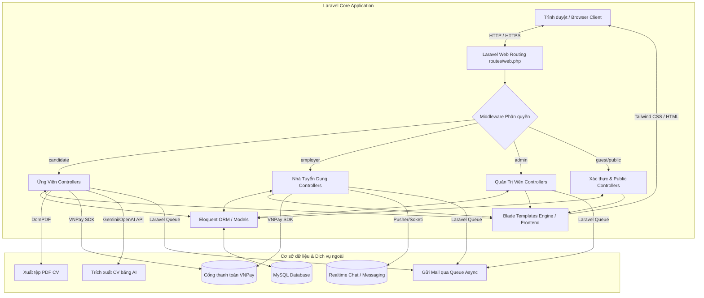

<p align="center">
  <a href="#" target="_blank">
    
  </a>
</p>

<h1 align="center">🚀 Web Tìm Việc IT (IT Job Portal)</h1>

<p align="center">
  Hệ thống tuyển dụng chuyên biệt dành cho ngành Công nghệ thông tin được xây dựng trên nền tảng Laravel MVC. Hỗ trợ đầy đủ các tính năng cho Ứng viên, Nhà tuyển dụng và Quản trị viên với khả năng tích hợp thanh toán VNPay, tạo CV trực tuyến và tích hợp AI.
</p>

<p align="center">
  <a href="#-kiến-trúc-tổng-thể-overall-architecture"></a>
  <a href="https://laravel.com"></a>
  <a href="https://tailwindcss.com"></a>
  <a href="#-giấy-phép-license"></a>
</p>

---

## 📋 Mục lục
1. [Giới thiệu](#-1-giới-thiệu-introduction)
2. [Các tính năng chính](#-2-các-tính-năng-chính-key-features)
3. [Kiến trúc tổng thể](#-3-kiến-trúc-tổng-thể-overall-architecture)
4. [Cài đặt](#-4-cài-đặt-installation)
5. [Chạy dự án](#-5-chạy-dự-án-running-the-project)
6. [Cấu hình môi trường (.env)](#-6-cấu-hình-môi-trường-env-configuration)
7. [Cấu trúc thư mục](#-7-cấu-trúc-thư-mục-folder-structure)
8. [Hướng dẫn đóng góp](#-8-hướng-dẫn-đóng-góp-contribution-guidelines)
9. [Lộ trình phát triển](#-9-lộ-trình-phát-triển-roadmap)
10. [Giấy phép](#-10-giấy-phép-license)

---

## 📖 1. Giới thiệu (Introduction)

**Web Tìm Việc IT** là giải pháp kết nối tuyển dụng hiện đại, tối ưu hóa quy trình kết nối giữa các kỹ sư phần mềm (Ứng viên) và doanh nghiệp công nghệ (Nhà tuyển dụng). Dự án tập trung vào trải nghiệm mượt mà, khả năng tương tác thời gian thực và tự động hóa với sự hỗ trợ của trí tuệ nhân tạo (AI).

Được xây dựng bằng **Laravel 11**, hệ thống đảm bảo tính bảo mật cực cao nhờ các cơ chế bảo vệ phân quyền lớp trung gian (Middleware) chặt chẽ, tối ưu hóa hiệu năng bằng cấu trúc queue xử lý tác vụ nền và tích hợp cổng thanh toán quốc gia VNPay.

---

## ✨ 2. Các tính năng chính (Key Features)

Dự án được phân rã thành 3 phân hệ chức năng riêng biệt tương ứng với 3 vai trò người dùng trong hệ thống:

### 👤 1. Phân hệ Ứng viên (Candidate)
* **Quản lý Hồ sơ & Kỹ năng:** Cập nhật thông tin chuyên môn, số năm kinh nghiệm và mức lương mong muốn.
* **Hệ thống tạo CV trực tuyến (CV Builder):**
  * Tải lên tệp CV sẵn có (PDF, DOCX).
  * Thiết kế CV trực tuyến và kết xuất (Export) sang tệp PDF chuyên nghiệp.
  * Tích hợp **AI Parse** phân tích và tự động điền thông tin CV.
* **Ứng tuyển & Theo dõi:** Nộp đơn ứng tuyển nhanh và cập nhật trạng thái hồ sơ theo thời gian thực.
* **Mua Token:** Mua token ứng tuyển thông qua cổng thanh toán VNPay.

### 🏢 2. Phân hệ Nhà tuyển dụng (Employer)
* **Đăng tin tuyển dụng (Job Posting):** Soạn thảo, chỉnh sửa, ẩn/hiện và đóng tin tuyển dụng (yêu cầu tài khoản có gói dịch vụ còn hạn).
* **Quản lý đơn ứng tuyển:**
  * Xem danh sách ứng viên, thông tin chi tiết và tải CV.
  * Duyệt hồ sơ và chuyển đổi trạng thái ứng tuyển.
  * Đánh dấu ưu tiên ứng viên (Shortlist) và tự động gửi email thông báo.
* **Mua gói dịch vụ (Premium):** Đăng ký gói dịch vụ theo tháng/năm tích hợp cổng VNPay để có quyền đăng tin.
* **Trò chuyện trực tuyến (Chat):** Nhắn tin thời gian thực với các ứng viên đã nộp đơn.

### 🔑 3. Phân hệ Quản trị viên (Admin)
* **Dashboard Thống kê:** Theo dõi tăng trưởng người dùng, số lượng tin đăng và doanh thu.
* **Quản lý người dùng:** Khóa/mở khóa tài khoản (Ban/Unban), cập nhật vai trò, gia hạn gói dịch vụ thủ công hoặc xóa người dùng.
* **Kiểm duyệt tin đăng:** Phê duyệt (Approve) hoặc từ chối (Reject) các tin đăng chờ duyệt từ nhà tuyển dụng.
* **Quản lý giao dịch:** Truy vấn lịch sử các giao dịch thanh toán qua cổng VNPay.
* **Quản lý thông báo:** Phát thông báo hàng loạt (Broadcast) tới toàn bộ người dùng và dọn dẹp hệ thống.

---

## 🏗️ 3. Kiến trúc tổng thể (Overall Architecture)

Hệ thống được thiết kế theo mô hình **MVC Monolith** kết hợp với các dịch vụ bổ trợ bên ngoài để xử lý tác vụ nặng và giao tiếp thời gian thực.



---

## 📦 4. Cài đặt (Installation)

Yêu cầu môi trường tối thiểu:
* PHP >= 8.2 (đã kích hoạt các extension cần thiết như `pdo_mysql`, `openssl`, `mbstring`, `curl`, `gd`)
* Composer >= 2.0
* Node.js >= 18.0 & NPM
* MySQL >= 8.0

### Các bước cài đặt:

1. **Clone dự án từ GitHub:**
   ```bash
   git clone https://github.com/yourusername/web_timviec.git
   cd web_timviec
   ```

2. **Cài đặt các thư viện PHP (Composer):**
   ```bash
   composer install
   ```

3. **Cài đặt các thư viện Frontend (NPM):**
   ```bash
   npm install
   ```

4. **Sao chép cấu hình môi trường:**
   ```bash
   cp .env.example .env
   ```

5. **Khởi tạo khóa ứng dụng (Application Key):**
   ```bash
   php artisan key:generate
   ```

6. **Tạo liên kết thư mục lưu trữ (Storage Link):**
   ```bash
   php artisan storage:link
   ```

7. **Thiết lập và chạy cơ sở dữ liệu:**
   * Tạo một database trống trong MySQL (ví dụ: `web_timviec`).
   * Cấu hình thông số database trong file `.env` (Xem phần [Cấu hình môi trường](#-6-cấu-hình-môi-trường-env-configuration)).
   * Chạy migrations và dữ liệu mẫu (Seed):
     ```bash
     php artisan migrate --seed
     ```
     *(Hoặc bạn có thể import trực tiếp tệp SQL đi kèm có sẵn trong dự án: `timviec.sql`)*

---

## 🏃 5. Chạy dự án (Running the project)

Sau khi cài đặt thành công, chạy đồng thời hai tiến trình sau để phát triển dự án cục bộ:

1. **Khởi động Local Development Server của PHP (Laravel Artisan):**
   ```bash
   php artisan serve
   ```
   *Ứng dụng của bạn sẽ mặc định chạy tại địa chỉ:* [http://127.0.0.1:8000](http://127.0.0.1:8000)

2. **Khởi động Vite Dev Server phục vụ build Frontend (Tailwind/Asset):**
   ```bash
   npm run dev
   ```

3. **Khởi động hàng đợi xử lý Email / Notification (Laravel Queue):**
   ```bash
   php artisan queue:work
   ```

---

## ⚙️ 6. Cấu hình môi trường (.env Configuration)

Cần đảm bảo các giá trị sau được cấu hình chính xác trong tệp `.env` của bạn:

```env
APP_NAME="Web Tìm Việc IT"
APP_ENV=local
APP_KEY=base64:YOUR_GENERATED_KEY...
APP_DEBUG=true
APP_URL=http://127.0.0.1:8000

# Cấu hình Cơ sở dữ liệu
DB_CONNECTION=mysql
DB_HOST=127.0.0.1
DB_PORT=3306
DB_DATABASE=web_timviec
DB_USERNAME=root
DB_PASSWORD=your_password

# Cấu hình Mail Service (Sử dụng để gửi thông báo/shortlist)
MAIL_MAILER=smtp
MAIL_HOST=sandbox.smtp.mailtrap.io
MAIL_PORT=2525
MAIL_USERNAME=your_mailtrap_username
MAIL_PASSWORD=your_mailtrap_password
MAIL_ENCRYPTION=tls
MAIL_FROM_ADDRESS="no-reply@timviecit.com"
MAIL_FROM_NAME="${APP_NAME}"

# Cấu hình thanh toán VNPay Sandbox
VNP_TMN_CODE=your_vnp_tmn_code
VNP_HASH_SECRET=your_vnp_hash_secret
VNP_URL=https://sandbox.vnpayment.vn/paymentv2/vpcpay.html
VNP_RETURN_URL_TOKEN=http://127.0.0.1:8000/payment/token/callback
VNP_RETURN_URL_SUB=http://127.0.0.1:8000/payment/subscription/callback

# Cấu hình API AI Parser (OpenAI / Gemini)
AI_API_KEY=your_ai_api_key
```

---

## 📁 7. Cấu trúc thư mục (Folder Structure)

Cấu trúc thư mục tuân theo chuẩn mực của Laravel MVC kết hợp assets quản lý bởi Vite:

```
web_timviec/
├── app/
│   ├── Http/
│   │   ├── Controllers/             # Xử lý các request từ người dùng
│   │   │   ├── Auth/                # Đăng ký, đăng nhập thường & OAuth (Google/GitHub)
│   │   │   ├── Admin/               # Quản lý người dùng, duyệt tin, thống kê
│   │   │   ├── UserController.php   # Quản lý CV & Tài khoản ứng viên
│   │   │   ├── JobController.php    # CRUD tin tuyển dụng
│   │   │   └── PaymentController.php# Tích hợp VNPay thanh toán
│   │   └── Middleware/              # Kiểm tra quyền truy cập (candidate, employer, admin...)
│   ├── Models/                      # Định nghĩa các Model & Quan hệ dữ liệu (Eloquent)
│   └── Mail/                        # Các lớp đại diện cho email gửi đi (ShortlistMail, PurchaseMail)
├── bootstrap/                       # Cấu hình khởi tạo và nạp ứng dụng
├── config/                          # Lưu trữ toàn bộ các tệp cấu hình hệ thống
├── database/
│   ├── migrations/                  # Tệp khởi tạo cấu trúc bảng cơ sở dữ liệu
│   └── seeders/                     # Tệp sinh dữ liệu mẫu ban đầu
├── public/                          # Chứa tài nguyên công khai truy cập trực tiếp
├── resources/
│   ├── views/                       # Blade Templates (Giao diện Frontend)
│   │   ├── user/                    # Giao diện hồ sơ, đăng ký, CV Builder
│   │   ├── job/                     # Giao diện tin tuyển dụng, danh sách tìm kiếm
│   │   ├── admin/                   # Khu vực trang quản trị viên
│   │   └── layout/                  # Giao diện mẫu khung (Base layouts)
│   ├── css/                         # File định kiểu Tailwind CSS
│   └── js/                          # File script điều khiển logic UI
├── routes/
│   └── web.php                      # Khai báo toàn bộ URL của hệ thống
├── storage/                         # Lưu trữ log, cache và các tệp tải lên (CV, ảnh đại diện)
└── vite.config.js                   # Cấu hình công cụ bundler tài nguyên frontend
```

---

## 🤝 8. Hướng dẫn đóng góp (Contribution Guidelines)

Chúng tôi rất hoan nghênh sự đóng góp của bạn để dự án ngày càng hoàn thiện hơn. Vui lòng làm theo các bước sau:

1. **Fork** dự án này về tài khoản cá nhân của bạn.
2. Tạo một nhánh (branch) mới cho tính năng của bạn:
   ```bash
   git checkout -b feature/amazing-feature
   ```
3. Commit những thay đổi của bạn kèm theo thông điệp rõ ràng:
   ```bash
   git commit -m "Add: Thêm tính năng gợi ý việc làm thông minh"
   ```
4. Push nhánh của bạn lên Remote GitHub:
   ```bash
   git push origin feature/amazing-feature
   ```
5. Mở một **Pull Request** trên repository gốc và mô tả chi tiết những thay đổi của bạn.

---

## 🗺️ 9. Lộ trình phát triển (Roadmap)

- [x] Tích hợp thanh toán trực tuyến qua cổng VNPay.
- [x] Phát triển module tạo CV trực tuyến và xuất PDF bằng DomPDF.
- [x] Tích hợp AI phân tích CV (AI Parse).
- [ ] Triển khai hệ thống trò chuyện thời gian thực (Realtime Chat bằng Pusher/Soketi).
- [ ] Gợi ý việc làm thông minh dựa trên kỹ năng của ứng viên (Job Matching Recommendation).
- [ ] Phát triển ứng dụng di động (Mobile App) cho Ứng viên sử dụng Flutter.

---

## 📄 10. Giấy phép (License)

Dự án này được cấp phép theo các điều khoản của **MIT License**. Xem chi tiết tại tệp [LICENSE](LICENSE) hoặc truy cập [opensource.org/licenses/MIT](https://opensource.org/licenses/MIT).
